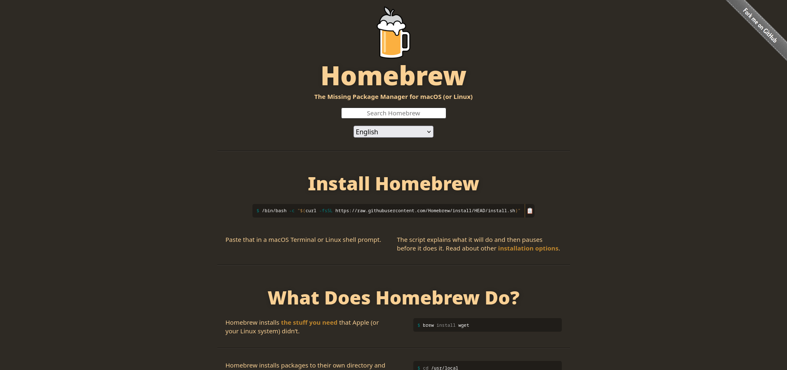

---
## Front matter
lang: ru-RU
title: Написание отчета и презентации с помощью Markdown
author: |
  Генералов Даниил, НПИбд-01-21, 1032212280
institute: |
	\inst{1}RUDN University, Moscow, Russian Federation
date: 28 April -- 28 April, 2022

## Formatting
toc: false
slide_level: 2
theme: metropolis
header-includes: 
 - \metroset{progressbar=frametitle,sectionpage=progressbar,numbering=fraction}
 - '\makeatletter'
 - '\beamer@ignorenonframefalse'
 - '\makeatother'
aspectratio: 43
section-titles: true
---

# Цель работы

- Изучить основы синтаксиса Markdown

- Научиться применять Markdown и Pandoc для составления отчетов и презентаций

- Написать отчет и презентацию и сделать презентацию презентации

# Ход работы

## Установка Pandoc

На Arch Linux все пакеты легко устанавливаются с помощью `yay`

На Fedora все несколько сложнее:

- Сначала нужно установить Pandoc: `sudo dnf install pandoc`
- Затем попробовать скомпилировать и увидеть недостаток `pandoc-crossref`
- `sudo dnf install pandoc-crossref` не работает
- Нужно установить пакетный менеджер Homebrew (рисунок [-@fig:001])

{ #fig:001 width=70% }

## Установка Pandoc (продолжение)

- После того, как Homebrew установлен, нужно добавить его в PATH:
  
  ```bash
  export PATH="/home/dmgeneralov/.linuxbrew/Homebrew/bin:$PATH"
  ```
- Теперь можно установить: `brew install pandoc-crossref`
- После этого оказывается нужно иметь LaTeX: `sudo dnf install texlive-scheme-full`

## Сборка отчета

После того, как все пакеты установлены, нужно написать отчет и презентацию.
Затем можно запустить `Makefile`, чтобы собрать их в PDF и DOCX-файлы.

Частые ошибки:

- Нарушены ссылки на картинки

- Изменены параметры в `front matter` на несовместимые

- Не все пакеты LaTeX установлены

- Не установлен `pandoc` или `pandoc-crossref`

- Не та рабочая директория

# Вывод

- Pandoc -- это очень удобный инструмент для стандартных преобразований документов.

- Но его нужно правильно установить.

- В Fedora не все пакеты доступны, и приходится использовать сторонние пакетные менеджеры.

- Когда все пакеты установлены, пользоваться ими удобно, но начальная настройка не всегда так проста.