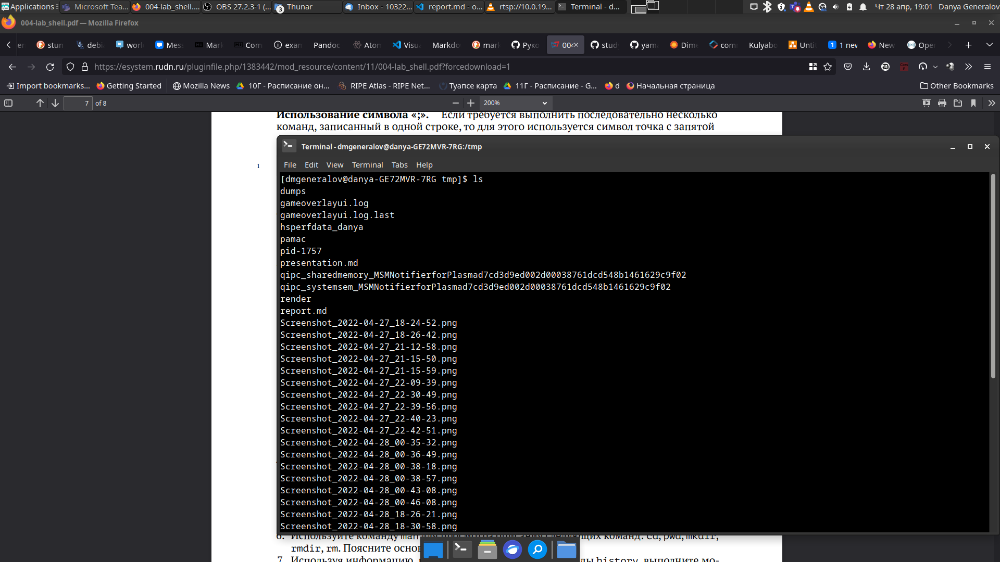

---
## Front matter
title: "Отчет по лабораторной работе 4"
subtitle: "Основы интерфейса взаимодействия пользователя с системой Unix на уровне командной строки"
author: "Генералов Даниил, НПИ-01-21, 1032212280"

## Generic otions
lang: ru-RU
toc-title: "Содержание"

## Bibliography
bibliography: bib/cite.bib
csl: pandoc/csl/gost-r-7-0-5-2008-numeric.csl

## Pdf output format
toc: true # Table of contents
toc-depth: 2
lof: true # List of figures
lot: true # List of tables
fontsize: 12pt
linestretch: 1.5
papersize: a4
documentclass: scrreprt
## I18n polyglossia
polyglossia-lang:
  name: russian
  options:
	- spelling=modern
	- babelshorthands=true
polyglossia-otherlangs:
  name: english
## I18n babel
babel-lang: russian
babel-otherlangs: english
## Fonts
mainfont: PT Serif
romanfont: PT Serif
sansfont: PT Sans
monofont: PT Mono
mainfontoptions: Ligatures=TeX
romanfontoptions: Ligatures=TeX
sansfontoptions: Ligatures=TeX,Scale=MatchLowercase
monofontoptions: Scale=MatchLowercase,Scale=0.9
## Biblatex
biblatex: true
biblio-style: "gost-numeric"
biblatexoptions:
  - parentracker=true
  - backend=biber
  - hyperref=auto
  - language=auto
  - autolang=other*
  - citestyle=gost-numeric
## Pandoc-crossref LaTeX customization
figureTitle: "Рис."
tableTitle: "Таблица"
listingTitle: "Листинг"
lofTitle: "Список иллюстраций"
lotTitle: "Список таблиц"
lolTitle: "Листинги"
## Misc options
indent: true
header-includes:
  - \usepackage{indentfirst}
  - \usepackage{float} # keep figures where there are in the text
  - \floatplacement{figure}{H} # keep figures where there are in the text
---

# Цель работы

Целью данной работы является приобретение практических навыков взаимодействия пользователя с системой посредством командной строки. Для выполнения этого задания делаются несколько стандартных действий для взаимодействия с системой, и в этом отчете задокументированно, какие именно действия я выполняю для этого.

# Теоретическое введение

Операционные системы, основанные на Unix, имеют широкий набор инструментов для взаимодействия с системой посредством командной строки. Это не случайно -- когда-то это был единственный способ взаимодействия, и даже сейчас он остается одним из самых удобных.

Фокус на текстовые интерфейсы 20 века, такие как телепринтеры и стеклянные терминалы, приводит к тому, что команды имеют короткие, иногда неочевидные названия -- `ls` для _list directory_, `cd` для _change directory_, `rm` для _remove_ и так далее. В этой работе мы рассмотрим самые базовые из этих команд и будем объяснять их назначение по ходу работы.

# Выполнение лабораторной работы

Для начала, для соблюдения соглашения о наименовании, нужно создать пользователя с правильным именем. Этот шаг уже сделан на виртуальных машинах, но его еще требуется сделать на моей рабочей машине. Увидеть то, как именно это происходит, можно на рисунке [-@fig:001]

{ #fig:001 width=70% }

После этого можно начать выполнение задания, и первым пунктом является переход в директорию `/tmp` и просмотр её содержимого. Чтобы перейти в эту директорию, нужно выполнить `cd /tmp`, а чтобы просмотреть файлы -- `ls`, как на рисунке [-@fig:002]. Можно также посмотреть дополнительную информацию о файлах и увидеть специальные записи `.` и `..`, которые есть в каждой директории и указывают на её саму и её родителя, соответственно. Чтобы посмотреть эти записи, можно использовать флаг `-a`, а чтобы посмотреть дополнительную информацию -- `-l`. Эти флаги можно также использовать вместе, как видно на рисунке [-@fig:003].

{ #fig:002 width=70% }

{ #fig:003 width=70% }

Следующий пункт -- проверить наличие директории под названием `/var/spool/cron`, что можно сделать, посмотрев на список файлов в `/var/spool` и проверив, что `cron` присутствует в нем и является директорией -- это действительно так, что можно увидеть на рисунке [-@fig:004].

{ #fig:004 width=70% }

После этого предлагается перейти в домашнюю директорию и проверить владельца и группу файлов, которые находятся там. Из-за того, что это новый пользователь, то его домашняя директория пуста. Более того, она принадлежит пользователю `root`, из-за чего нельзя добавлять туда файлы, но это не проблема -- с помощью одной команды `chown` можно поменять владельца этой директории, и после этого новые файлы принадлежат нашему пользователю. Все это видно на рисунке [-@fig:005].

{ #fig:005 width=70% }

Теперь нужно создать папку и внутри нее создать подпапку. Это можно сделать двумя командами `mkdir`. После этого нужно создать три других папки, и здесь я ошибся: я написал `mkdir {letters, memos, misk}`, ожидая, что будет использован синтаксис раскрытия перечислений. Однако, поскольку в этой команде есть пробелы, то эта строка воспринимается иначе: создаются три папки, имеющих название `{letters,` и `memos,` и `misk}` и это не то, что нужно. Поэтому я удаляю их с помощью `rmdir`, и переписываю эту команду без пробелов, что на этот раз правильно интерпретируется. Наконец, я делаю `rmdir`, чтобы удалить эти новые папки. Это можно увидеть на рисунке [-@fig:006].

{ #fig:006 width=70% }

Для удаления здесь мы использовали `rmdir`, но также можно использовать `rm`. Для того, чтобы это работало, необходимо указывать флаг `-r`, который диктует рекурсивное исполнение: для того, чтобы удалить папку, нужно сначала удалить все файлы внутри папки, и некоторые из этих файлов могут сами быть папками. Можно увидеть, что с этим флагом работает удаление директорий, на рисунке [-@fig:007].

{ #fig:007 width=70% }

Следующий важный шаг -- научиться, как читать инструкцию. В Linux для большинства программ есть так называемые `man`-страницы, которые рассказывают, среди прочего, какие опции есть у программ и как ими пользоваться. Так, можно прочитать, что у `ls` есть ключ `-R`, который позволяет просмотреть директории рекурсивно. Это написано в документе, который можно открыть, введя команду `man ls`, как показано на рисунке [-@fig:008].

{ #fig:008 width=70% }

В этом документе можно прочитать и про более сложные ключи, которые принимают параметры. Так, например, можно узнать, что можно посмотреть на расширенную информацию о файлах и отсортировать их по дате изменения, используя ключи `-l`, `--sort=time` и `--time=ctime`, как показано на рисунке [-@fig:009]. После этого можно выполнить команду с этими ключами и убедиться, что она делает именно то, что обещано, на рисунке [-@fig:010].

{ #fig:009 width=70% }

{ #fig:010 width=70% }

С помощью `man` можно узнать много интересного о командах вроде `cd`, `pwd`, `mkdir`, `rmdir` и `rm` -- хотя стоит заметить, что `cd` является встроенной в интерпретатор команд (в моем случае это `bash`), поэтому документация о этой команде не совсем относится к тому, как именно она реализована -- и документ даже говорит об этом, как можно увидеть на рисунке [-@fig:011].

{ #fig:011 width=70% }

Помимо этого, можно узнать, что:

- `cd` имеет параметры `-L` и `-P`, которые определяют, как именно следует воспринимать особую запись `..` в пути -- как настоящую символическую ссылку, или только как команду перейти на один уровень наверх;
- `pwd` имеет параметры `-L` и `-P`, которые говорят, следует ли показывать символические ссылки в отображаемом пути или стоит их разрешить в канонический путь;
- `mkdir` имеет параметр `-m`, который позволяет указать права доступа к создаваемой директории; параметр `-p`, который позволяет создавать все необходимые директории в пути, если они не существуют; и параметры `-Z` и `--context`, которые управляют контекстом безопасности SELinux, в котором будут находиться созданные директории;
- `rmdir` имеет параметр `-p`, который удалит не только саму директорию, но и всех ее пустых родителей, и параметр `-v`, который позволяет выводить информацию о том, какие директории были удалены; 
- `rm` имеет параметр `-r`, который позволяет программе работать рекурсивно; параметр `-f`, который позволяет удалять файлы и директории без предупреждения; и параметр `-i`, который, наоборот, спрашивает разрешения прежде чем удалить каждый файл.

Наконец, используя встроенную команду `history`, можно посмотреть историю выполнения команд, и из этой истории можно достать и изменить команды, чтобы выполнить одно и то же действие несколько раз, как показано на рисунке [-@fig:012].

{ #fig:012 width=70% }

# Выводы

В этой работе мы рассмотрели основы работы с командной строкой Linux, рассмотрев команды перехода между папками, создания и удаления папок, и просмотра документации. Используя эти навыки, можно работать с компьютером быстрее и эффективнее, чем с графическим интерфейсом, и эта простота и быстрота остается причиной, почему текстовый интерфейс до сих пор доступен в современных компьютерах.