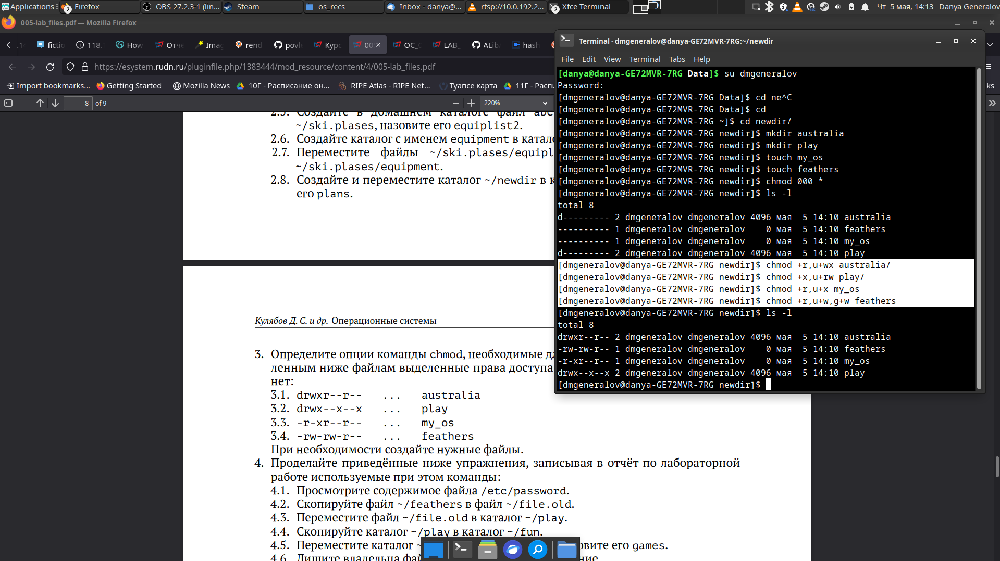

---
## Front matter
lang: ru-RU
title: Лабораторная работа 5
author: |
  Генералов Даниил, НПИ-01-21, 1032212280
institute: |
	\inst{1}RUDN University, Moscow, Russian Federation
date: 2021, 7 May

## Formatting
toc: false
slide_level: 2
theme: metropolis
header-includes: 
 - \metroset{progressbar=frametitle,sectionpage=progressbar,numbering=fraction}
 - '\makeatletter'
 - '\beamer@ignorenonframefalse'
 - '\makeatother'
aspectratio: 43
section-titles: true
---

# Цель работы

Получить навыки работы с файловой системой Linux, в частности с файлами и папками, а также с правами доступа к файлам и папкам.

## Задачи

- Опробовать команды `mkdir`, `mv` и `cp` для работы с файлами и папками
- Опробовать команду `chmod` для изменения прав доступа к файлам и папкам
- Изучить документацию для команд `mkfs`, `fsck` и `mount`

# Ход работы

## Манипуляция файлами и папками

Можно переименовывать файлы, папки, а также перемещать их в другие папки, используя команду `mv`, а команда `mkdir` создаст нужные папки.

## Права доступа

Можно изменять права доступа к файлам и папкам, используя команду `chmod` с указанием желаемых изменений. Проверить текущие права можно, используя команду `ls -l`, или попробовав сделать релевантное действие.

## Создание и использование файловых систем

Чтобы создать пустую файловую систему на диске или другом файле, нужно использовать команду `mkfs`. После чего можно использовать команду `mount` для подключения файловой системы к дереву директорий. Если файловая система повреждена, можно попробовать ее восстановить, используя команду `fsck`.

# Вывод

- Мы изучили основы работы внутри файловой системы и над ней
- Права доступа (особенно право на исполнение) являются частым источником недопонимания у пользователей
- Создание файловых систем, хотя требуется не часто, бывает очень важно, и поэтому нужно знать релевантные команды

