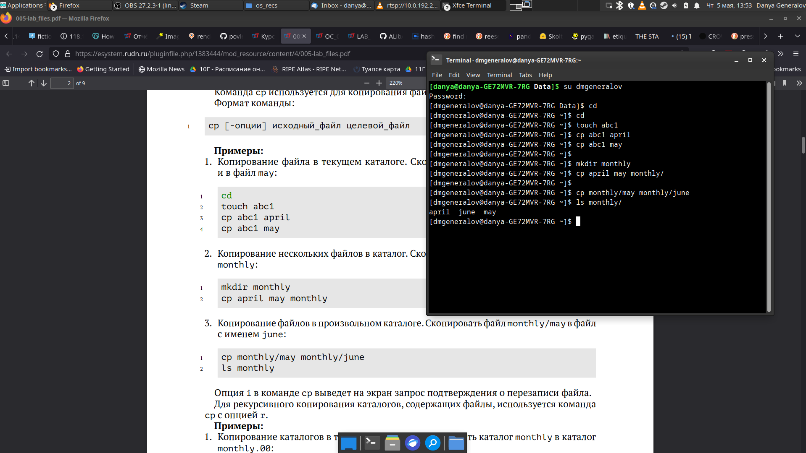
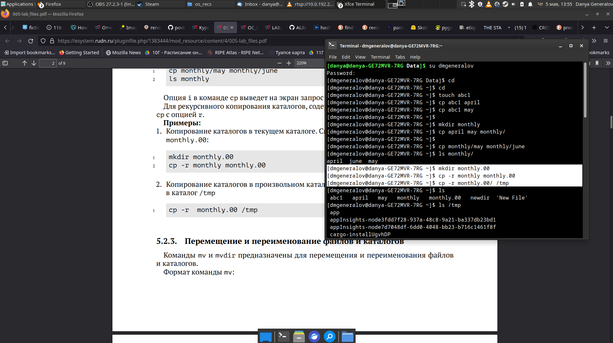
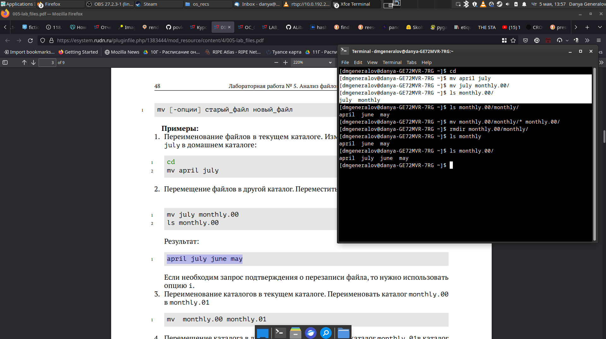
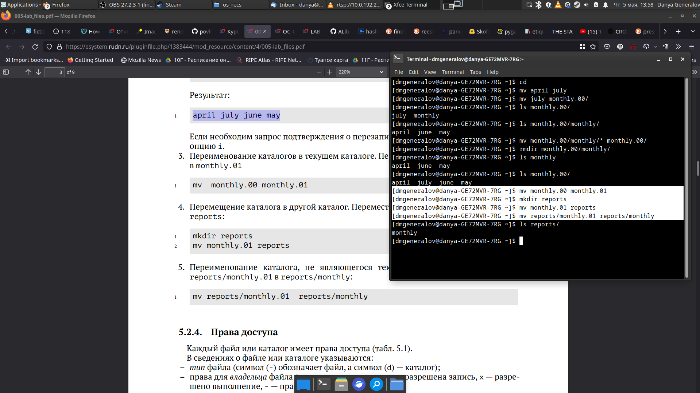
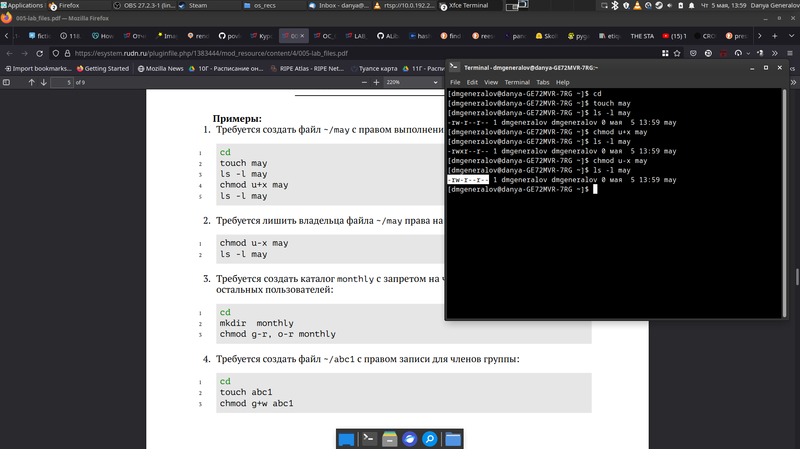
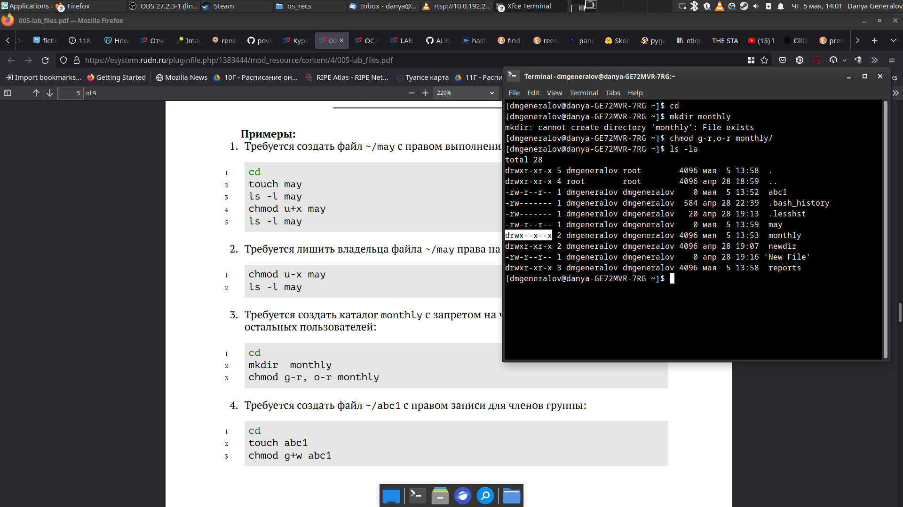
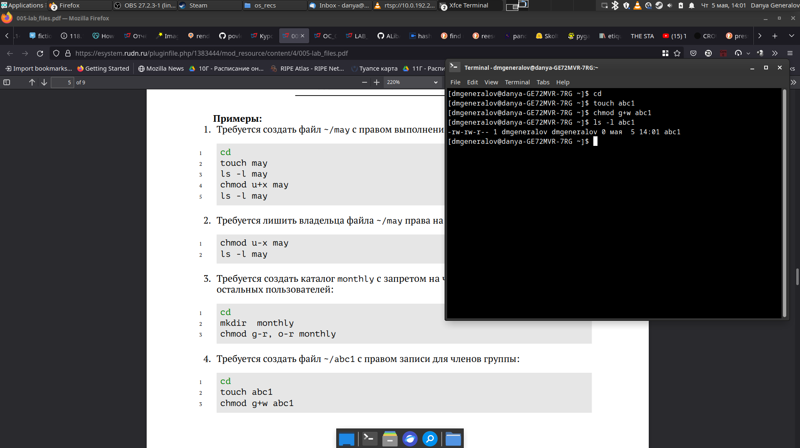
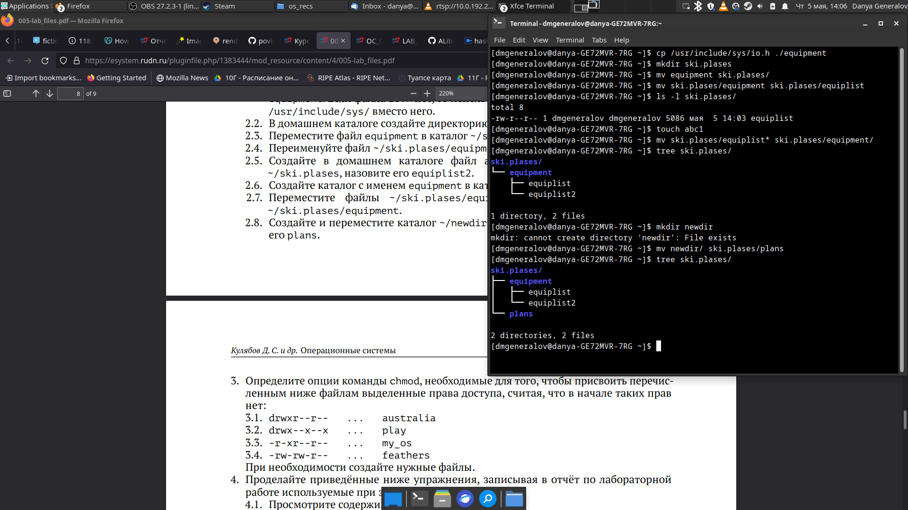
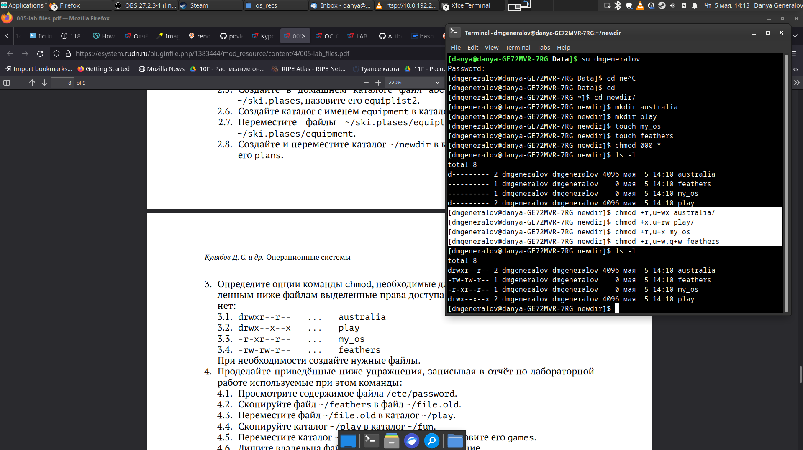
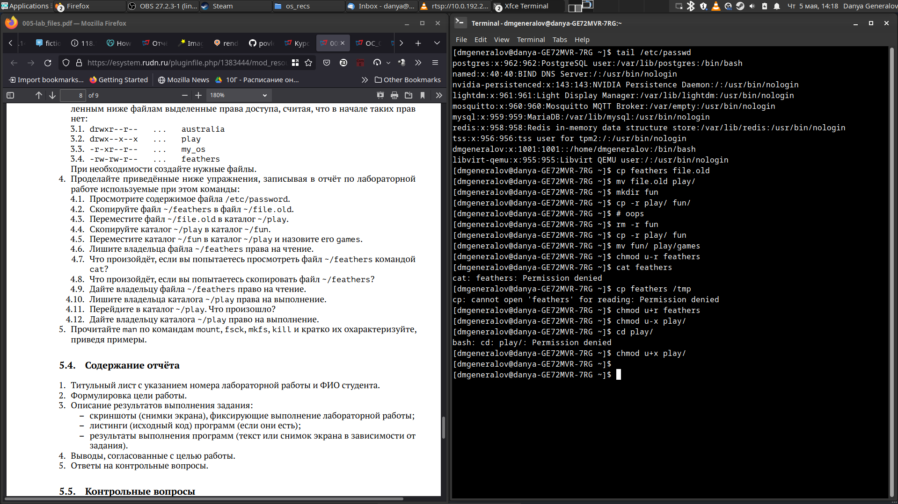

---
## Front matter
title: "Отчет по лабораторной работе 5"
subtitle: "Анализ файловой системы Linux"
author: "Генералов Даниил, НПИ-01-21, 1032212280"

## Generic otions
lang: ru-RU
toc-title: "Содержание"

## Bibliography
bibliography: bib/cite.bib
csl: pandoc/csl/gost-r-7-0-5-2008-numeric.csl

## Pdf output format
toc: true # Table of contents
toc-depth: 2
lof: true # List of figures
lot: true # List of tables
fontsize: 12pt
linestretch: 1.5
papersize: a4
documentclass: scrreprt
## I18n polyglossia
polyglossia-lang:
  name: russian
  options:
	- spelling=modern
	- babelshorthands=true
polyglossia-otherlangs:
  name: english
## I18n babel
babel-lang: russian
babel-otherlangs: english
## Fonts
mainfont: PT Serif
romanfont: PT Serif
sansfont: PT Sans
monofont: PT Mono
mainfontoptions: Ligatures=TeX
romanfontoptions: Ligatures=TeX
sansfontoptions: Ligatures=TeX,Scale=MatchLowercase
monofontoptions: Scale=MatchLowercase,Scale=0.9
## Biblatex
biblatex: true
biblio-style: "gost-numeric"
biblatexoptions:
  - parentracker=true
  - backend=biber
  - hyperref=auto
  - language=auto
  - autolang=other*
  - citestyle=gost-numeric
## Pandoc-crossref LaTeX customization
figureTitle: "Рис."
tableTitle: "Таблица"
listingTitle: "Листинг"
lofTitle: "Список иллюстраций"
lotTitle: "Список таблиц"
lolTitle: "Листинги"
## Misc options
indent: true
header-includes:
  - \usepackage{indentfirst}
  - \usepackage{float} # keep figures where there are in the text
  - \floatplacement{figure}{H} # keep figures where there are in the text
---

# Цель работы

Целью этой работы является ознакомление с файловой системой Linux, её структурой, именами и содержанием
каталогов, приобретение практических навыков по применению команд для работы
с файлами и каталогами, по управлению процессами (и работами), по проверке использования диска и обслуживанию файловой системы.

# Задание

Требуется выполнить набор команд, приведенных в задании лабораторной работы, и описать их поведение

# Теоретическое введение

В ОС Linux и других, использующих такую же структуру файловой системы, существуют файлы и каталоги, которые могут содержать файлы и каталоги. У каждого из файлов и каталогов есть владеющий пользователь и группа, которые описывают, какие действия разрешены владеющему пользователю, пользователям из владеющей группы, и всем остальным пользователям, и эти действия -- чтение, запись и исполнение. 

# Выполнение лабораторной работы

Сначала нужно выполнить примеры, приведенные в первой части документа. Первый из примеров, показанный на рис. [-@fig:001], показывает, как создавать файлы, копировать их и создавать папки.

{ #fig:001 width=70% }

Второй пример, на рис. [-@fig:002], показывает, как копировать папки -- для этого нужно использовать ключ `-r` в команде `cp`.

{ #fig:002 width=70% }

Третий пример, на рис. [-@fig:003], говорит о том, как перемещать файлы и папки и переименовывать их -- что, в зависимости от файловой системы, может быть одно и то же действие, поэтому для обоих операций используется одна и та же команда `mv`. Здесь мы видим ошибку в задании -- в предыдущем примере нам предлагали скопировать `monthly` в `monthly.00`, что значит, что папка `~/monthly` превратилась в `~/monthly.00/monthly`, а в условии примера ожидалось, что *содержимое* папки `monthly` окажется внутри `monthly.00`. Я исправил это вручную, чтобы продолжить выполнение примера, но это ошибка в задании.

{ #fig:003 width=70% }

Четвертый пример на рис. [-@fig:004] расширяет эту тему и показывает, как перемещать сами каталоги между каталогами. Это также делается с помощью команды `mv`.

{ #fig:004 width=70% }

Пятый пример, на рис. [-@fig:005], вводит понятие разрешений на файлы. Используя команду `chmod`, мы можем изменить права доступа к файлу или папке. В данном примере мы изменили права доступа к файлу `may`, сначала добавив разрешение на исполнение, а затем убрав его -- это отображается в выводе команды `ls -l`.

{ #fig:005 width=70% }

В следующем шестом примере на рис. [-@fig:006] видно, что изменение разрешений на директории работает точно так же -- мы убрали разрешение на чтение директории `monthly` у группы и остальных, оставив только себе полные права на директорию.

{ #fig:006 width=70% }

Последний седьмой пример на рис. [-@fig:007] показывает, что для изменения прав на запись нужно использовать букву `w`, а не `r`, в указании разрешений для файла.

{ #fig:007 width=70% }

После этого нам больше не говорят, какие команды нужно использовать, и предлагают придумать подходящие самому. Для начала нужно скопировать файл, и для этого есть команда `cp`. Затем мы создаем папку с `mkdir` и переносим в нее файл с `mv`. Здесь я также использую команду `tree`, чтобы на рис. [-@fig:008] было удобно понять общее состояние нашей рабочей директории после всех действий.

{ #fig:008 width=70% }

Дальше предлагается создать несколько папок и файлов и задать разрешения для них. Сначала мы сбрасываем все разрешения командой `chmod 000`, а затем добавляем только те, которые нужны -- папка `australia` доступна для чтения всем и для записи и исполнения мне, папка `play` -- для исполнения всем и для чтения и записи мне, файл `my_os` -- для чтения всем и для исполнения мне, а файл `feathers` -- для чтения всем и для записи мне и группе. После этого мы проверяем состояние на рис. [-@fig:009].

{ #fig:009 width=70% }

В последнем задании нужно немного перемещать файлы и папки (и я ошибся в этом -- в формулировке задания сказано, что нужно *скопировать каталог `~/play` в каталог `~/fun`*, и сначала я подумал, что имеется в виду сделать копию `~/play` и разместить ее в `~/fun/play`, а оказалось, что копия должна называться `~/fun`), а затем посмотреть, что происходит, если попробовать прочитать файл без разрешения на чтение, попытаться его скопировать или попытаться зайти в папку, у которой нет разрешения на запись -- каждое из этих действий приводит к появлению ошибки о недостающем соответствующем разрешении, что можно увидеть на рис. [-@fig:010].

{ #fig:010 width=70% }

Наконец, нужно прочитать `man`-страницы для нескольких команд и понять, что они делают. После того, как я прочитал все четыре из них на рис. [@fig:011], я могу рассказать про их поведение.

{ #fig:011 width=70% }

Команда `mount` позволяет подключить файловую систему, находящуюся в файле по указанному пути, к дереву директорий, или посмотреть на то, какие директории уже примонтированны таким образом. 

```sh
$ mount
proc on /proc type proc (rw,nosuid,nodev,noexec,relatime)
sys on /sys type sysfs (rw,nosuid,nodev,noexec,relatime)
dev on /dev type devtmpfs (rw,nosuid,relatime,size=8118080k,nr_inodes=2029520,mode=755,inode64)
run on /run type tmpfs (rw,nosuid,nodev,relatime,mode=755,inode64)
efivarfs on /sys/firmware/efi/efivars type efivarfs (rw,nosuid,nodev,noexec,relatime)
/dev/mapper/luks-4cc500dd-7a2c-4d60-aaf4-fff508cae0db on / type ext4 (rw,noatime)
securityfs on /sys/kernel/security type securityfs (rw,nosuid,nodev,noexec,relatime)
tmpfs on /dev/shm type tmpfs (rw,nosuid,nodev,inode64)
devpts on /dev/pts type devpts (rw,nosuid,noexec,relatime,gid=5,mode=620,ptmxmode=000)
cgroup2 on /sys/fs/cgroup type cgroup2 (rw,nosuid,nodev,noexec,relatime,nsdelegate,memory_recursiveprot)
$ ls /mnt
$ sudo mount /dev/mmcblk0p1 /mnt
Please touch the device.
$ ls /mnt
 autorun.ico   boot.catalog   EFI          pool                         ubuntu
 autorun.inf   casper         install      preseed
 boot          dists          md5sum.txt  'System Volume Information'
 ```

Команда `fsck` позволяет проверить файловую систему на наличие ошибок. Она принимает на вход путь к файловой системе, которую нужно проверить, и пытается угадать, какая там применена файловая система, проверяет целостность ее структур данных, и при необходимости пробует поправить их -- иногда, в зависимости от файловой системы, будут предложены разные действия, между которыми можно интерактивно выбрать.


```sh
$ dd if=/dev/urandom of=/tmp/fakefs bs=1M count=1
$ fsck /tmp/fakefs
fsck from util-linux 2.38
e2fsck 1.46.5 (30-Dec-2021)
ext2fs_open2: Bad magic number in super-block
fsck.ext2: Superblock invalid, trying backup blocks...
fsck.ext2: Bad magic number in super-block while trying to open /tmp/fakefs

The superblock could not be read or does not describe a valid ext2/ext3/ext4
filesystem.  If the device is valid and it really contains an ext2/ext3/ext4
filesystem (and not swap or ufs or something else), then the superblock
is corrupt, and you might try running e2fsck with an alternate superblock:
    e2fsck -b 8193 <device>
 or
    e2fsck -b 32768 <device>

$ sudo fsck /dev/mmcblk0p1
fsck from util-linux 2.38
fsck.fat 4.2 (2021-01-31)
There are differences between boot sector and its backup.
This is mostly harmless. Differences: (offset:original/backup)
  65:01/00
1) Copy original to backup
2) Copy backup to original
3) No action
[123?q]? 3
There is no label in boot sector, but there is volume label 'UBUNTU 21_0' stored in root directory
1) Copy volume label from root directory to boot sector
2) Remove volume label from root directory
[12?q]? 1
Dirty bit is set. Fs was not properly unmounted and some data may be corrupt.
1) Remove dirty bit
2) No action
[12?q]? 1

*** Filesystem was changed ***
The changes have not yet been written, you can still choose to leave the
filesystem unmodified:
1) Write changes
2) Leave filesystem unchanged
[12?q]? 1
/dev/mmcblk0p1: 914 files, 86503/1948483 clusters
```

Команда `mkfs` позволяет создать файловую систему в указаном файле. Тип создаваемой файловой системы можно указать ключом `-t`, или вызвать напрямую одну из программ `mkfs.<fs-type>`, которые как раз делают саму работу по организации структур файловой системы.

```sh
$ dd if=/dev/zero of=/tmp/newfs.img bs=4M count=1
$ mkfs.fat /tmp/newfs.img
mkfs.fat 4.2 (2021-01-31)
$ sudo mount /tmp/newfs.img /mnt
$ cd /mnt
$ sudo wget https://en.wikipedia.org/wiki/Design_of_the_FAT_file_system -q
$ cd
$ sudo umount /mnt
$ strings /tmp/newfs.img | grep 'Design of the FAT file system' | wc -l
5
```

Команда `kill` служит для того, чтобы послать сигнал процессу. Обычно он приводит к тому, что процесс завершается, но некоторые программы делают что-то интересное с этим сигналом. Например, программа `dd`, когда получает сигнал `SIGUSR1` (или `SIGINFO`, в зависимости от версии), выводит статистику передачи информации.
  
```sh
$ dd if=/dev/urandom of=/dev/null &
[1] 184408
$ kill -USR1 184408
3774946+0 records in
3774945+0 records out
1932771840 bytes (1,9 GB, 1,8 GiB) copied, 12,4389 s, 155 MB/s
$ kill -USR1 184408
5169496+0 records in
5169496+0 records out
2646781952 bytes (2,6 GB, 2,5 GiB) copied, 17,0512 s, 155 MB/s
$ kill 184408
$ kill -USR1 184408
bash: kill: (184408) - No such process
[1]+  Terminated              dd if=/dev/urandom of=/dev/null
```

# Контрольные вопросы

1. Дайте характеристику каждой файловой системе, существующей на жёстком диске
компьютера, на котором вы выполняли лабораторную работу.

На моем компьютере на диске есть следующие файловые системы:
- FAT -- простая файловая система, основанная на таблицах, содержащих информацию о файлах и указатели на начало связного списка их содержимого. Используется для хранения системной информации в форме EFI System Partition, а также как загрузочный раздел для Linux.
- NTFS -- файловая система от Microsoft, хранящая информацию о директориях в форме B-деревьев, поддерживающая прозрачное сжатие, шифрование, дедупликацию и контроль доступа к ресурсам через ACL. Используется как основная файловая система для Windows, а также для раздела, который делит данные между двумя системами.
- LUKS -- система шифрования диска, основанная на `dm-crypt`, предоставляя шифрование блочного устройства внутри ядра Linux, позволяя использовать этот диск прозрачно для остальной системы. Содержит заголовок, который описывает параметры шифрования и содержит несколько слотов, каждый из которых может содержать главный ключ шифрования для диска, зашифрованный пользовательским ключом, позволяя менять ключи без перешифровки всего диска.

2. Приведите общую структуру файловой системы и дайте характеристику каждой директории первого уровня этой структуры.

В системах, которые придерживаются Filesystem Hierarchy Standard, в корне диска должны находиться следующие директории:

- `/bin` -- главные программы, необходимые для однопользовательского режима, которые позволяют починить систему (`cat`, `ls`, `cp` и другие) и должны быть доступны всем пользователям
- `/boot` -- загрузочные файлы
- `/dev` -- файлы устройств, включая диски, консоли и виртуальные файлы
- `/etc` -- конфигурационные файлы для всей системы
- `/home` -- директории пользователей
- `/lib` -- библиотеки и модули для программ в `/bin`
- `/lib64` -- библиотеки и модули для 64-битных программ
- `/media` -- директории для монтирования внешних носителей
- `/mnt` -- директории для временного монтирования файловых систем
- `/proc` -- виртуальная файловая система для информации о системе
- `/root` -- директория пользователя root
- `/run` -- директория для временных файлов
- `/sbin` -- главные системные программы
- `/srv` -- данные для серверов на системе
- `/tmp` -- директория для временных файлов
- `/usr` -- вторичная иерархия для данных многопользовательских программ
- `/var` -- директория для постоянно меняющихся файлов, вроде лог-файлов


3. Какая операция должна быть выполнена, чтобы содержимое некоторой файловой
системы было доступно операционной системе?

Эта операция называется "монтирование" и реализуется программой `/usr/bin/mount` или системным вызовом `mount` из `sys/mount.h`.


4. Назовите основные причины нарушения целостности файловой системы. Как устранить повреждения файловой системы?

Чаще всего файловая система повреждается, когда носитель информации выключается, пока структуры данных не полностью записаны на диск. Более редкие причины включают физическое повреждение носителя ("плохие секторы"), ошибочную интерпретацию содержимого файловой системы, случайные изменения на битовом уровне ("космические лучи") и другие причины. В зависимости от степени повреждения можно попробовать использовать стандартную утилиту `fsck`, включенную в комплекте с файловой системой.

5. Как создаётся файловая система?

Программа `mkfs`, создающая файловую систему, сначала очищает заголовок диска, стирая информацию, которая использовалась старой файловой системой для распознания диска, затем пишет туда свой заголовок, и проходит по диску, добавляя структуры данных, которые нужны ей для функционирования.  

6. Дайте характеристику командам для просмотра текстовых файлов.

Для просмотра файлов используются программы, которые интерактивно выводят часть файла и ждут ввода, так называемые "пейджеры" -- это `more`, которая останавливает вывод, прежде чем перейти на следующий экран, и `less`, которая использует `curses`, чтобы предоставить интерактивное окно с функционалом вроде прокрутки вверх и поиска.

7. Приведите основные возможности команды cp в Linux.

Программа `cp` может копировать файлы и директории, возможно читая символические ссылки и создавая их, а также интерактивно спрашивать пользователя, какие файлы нужно копировать.

8. Приведите основные возможности команды mv в Linux.

Программа `mv` может перемещать файлы и директории между директориями, или переименовывать файлы и директории.

9. Что такое права доступа? Как они могут быть изменены?

Права доступа -- это набор битов, которые диктуют, какие действия разрешается выполнять с файлом или директорией, и какой группой пользователей. Права доступа могут быть изменены при помощи `/usr/bin/chmod`, или с помощью системного вызова `chmod` в `sys/stat.h`.

# Выводы

В этой работе мы рассмотрели, как перемещать файлы между директориями и как работают права доступа для этих файлов. Эти два знания являются основой для работы с файлами и директориями в Linux. Понимание значимости битов чтения, записи и исполняемости является очень важным для эффективной работы с программами и файлами, а понимание пользователей и групп нужно при работе с другими за одним компьютером для разграничения доступа.