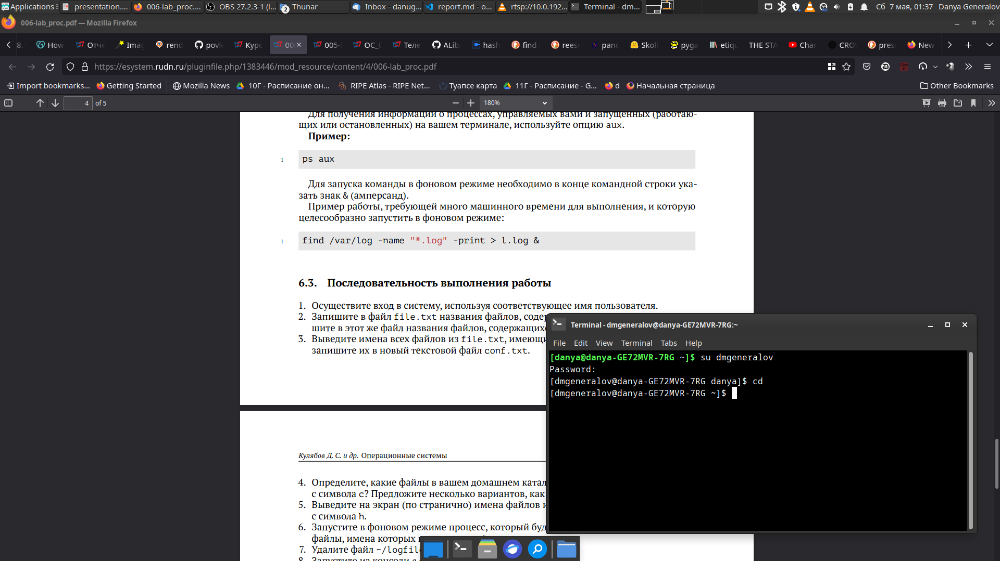
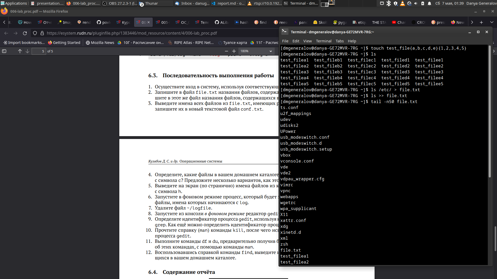
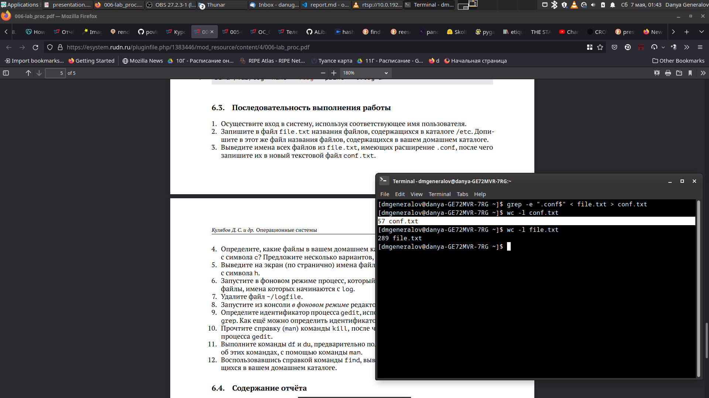
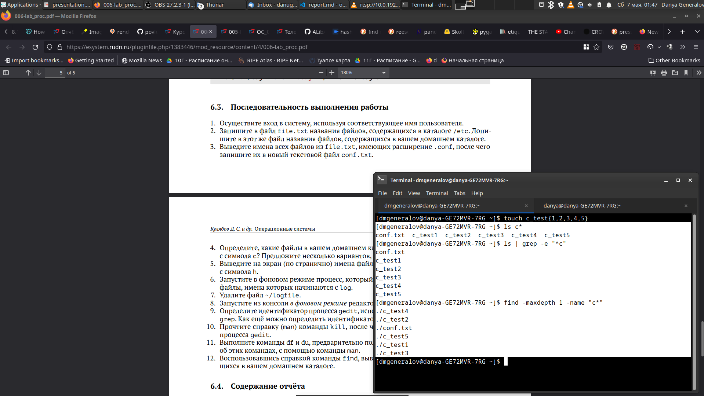
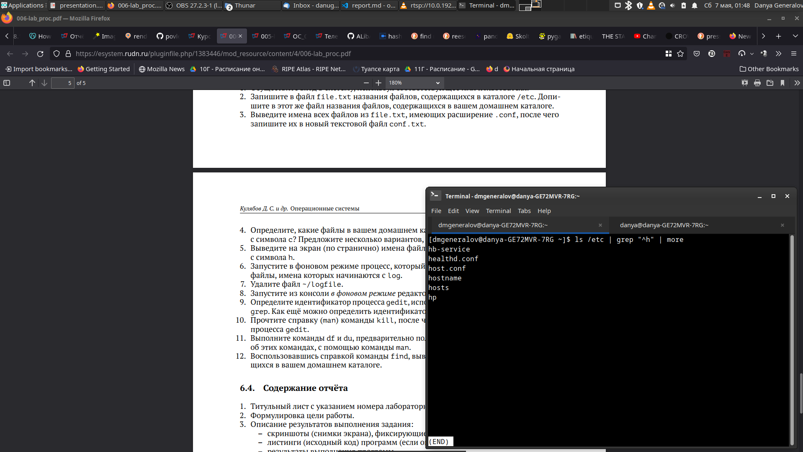
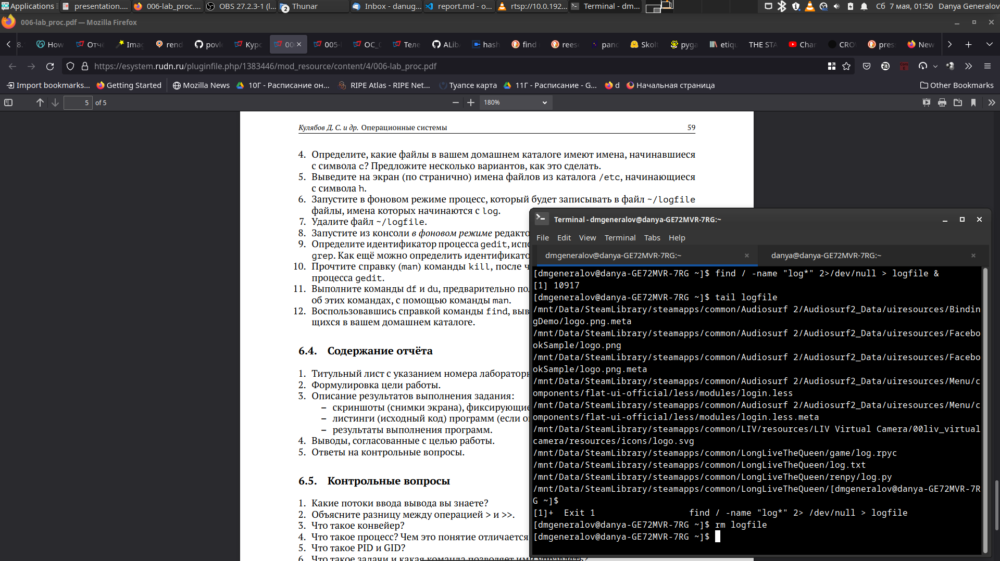
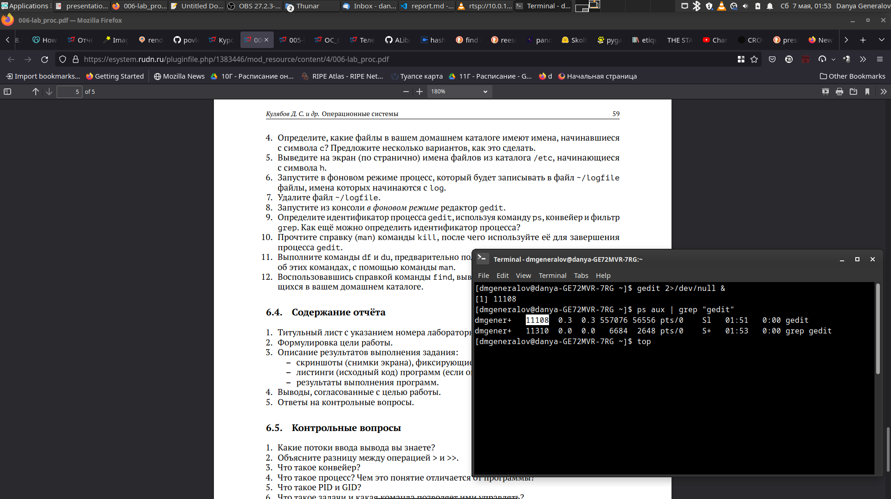
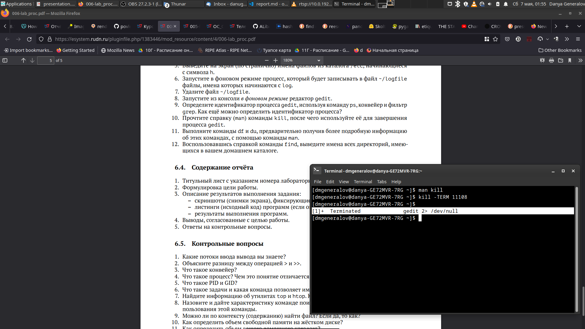
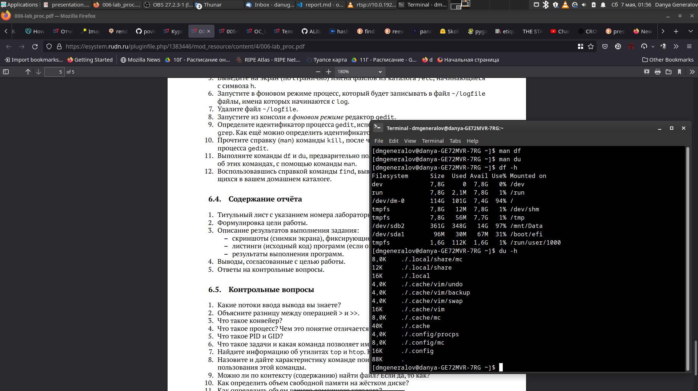
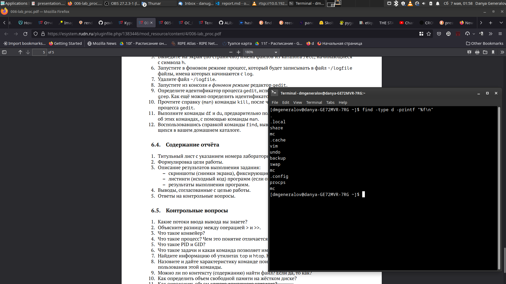

---
## Front matter
title: "Лабораторная работа 6"
subtitle: "Поиск файлов. Перенаправление
ввода-вывода. Просмотр запущенных процессов"
author: "Генералов Даниил, НПИ-01-21, 1032212280"

## Generic otions
lang: ru-RU
toc-title: "Содержание"

## Bibliography
bibliography: bib/cite.bib
csl: pandoc/csl/gost-r-7-0-5-2008-numeric.csl

## Pdf output format
toc: true # Table of contents
toc-depth: 2
lof: true # List of figures
lot: true # List of tables
fontsize: 12pt
linestretch: 1.5
papersize: a4
documentclass: scrreprt
## I18n polyglossia
polyglossia-lang:
  name: russian
  options:
	- spelling=modern
	- babelshorthands=true
polyglossia-otherlangs:
  name: english
## I18n babel
babel-lang: russian
babel-otherlangs: english
## Fonts
mainfont: PT Serif
romanfont: PT Serif
sansfont: PT Sans
monofont: PT Mono
mainfontoptions: Ligatures=TeX
romanfontoptions: Ligatures=TeX
sansfontoptions: Ligatures=TeX,Scale=MatchLowercase
monofontoptions: Scale=MatchLowercase,Scale=0.9
## Biblatex
biblatex: true
biblio-style: "gost-numeric"
biblatexoptions:
  - parentracker=true
  - backend=biber
  - hyperref=auto
  - language=auto
  - autolang=other*
  - citestyle=gost-numeric
## Pandoc-crossref LaTeX customization
figureTitle: "Рис."
tableTitle: "Таблица"
listingTitle: "Листинг"
lofTitle: "Список иллюстраций"
lotTitle: "Список таблиц"
lolTitle: "Листинги"
## Misc options
indent: true
header-includes:
  - \usepackage{indentfirst}
  - \usepackage{float} # keep figures where there are in the text
  - \floatplacement{figure}{H} # keep figures where there are in the text
---

# Цель работы

Целью данной работы является ознакомление с инструментами поиска файлов и фильтрации текстовых данных и
приобретение практических навыков по управлению процессами (и заданиями), по проверке использования диска и обслуживанию файловых систем.

# Задание

В рамках работы нужно:

- Использовать инструменты `find` и `grep` для поиска файлов
- Использовать операторы `>`, `>>` и `|` для перенаправления вывода
- Использовать оператор `&` для запуска процессов в фоне и команду `ps` для просмотра запущенных процессов

# Теоретическое введение

Почти все командные интерпретаторы, поддерживающие взаимодействие между программами, являются уни-типизированными по строкам: программы могут передавать друг другу строковые значения, будь то как аргументы или через перенаправление ввода-вывода.
Благодаря тому, что все операции имеют один и тот же тип принимаемых и возвращаемых значений, несколько более простых программ можно связывать вместе, чтобы делать одну более сложную операцию. Используя программы вроде `grep`, которые манипулируют вводом по определенным правилам, можно модифицировать данные в цепочке программ.

# Выполнение лабораторной работы

Первым шагом лабораторной работы предлагается зайти в систему под правильным именем пользователя. Не совсем понятно, из-за чего это действие прописано здесь, когда в предыдущих лабораторных работах этого не было, но в интересах полноты я показываю, как это делаю, на рис. [-@fig:001].

{ #fig:001 width=70% }

Затем нужно создать файл, содержащий список названий файлов в домашней директории, и список файлов в `/etc`. Чтобы было видно, что первый шаг получился, я создал несколько тестовых файлов в домашней директории в формате `test_fileX_Y`, где X и Y -- значения, меняющиеся от a до e и от 1 до 5. Это можно увидеть на рис. [-@fig:002].

{ #fig:002 width=70% }

Третьим шагом нужно отфильтровать этот список, оставив только строки, заканчивающиеся на `.conf`. Для этого мы используем команду `grep`, указывая, что нужно оставить только строки, в которых есть точка, затем буквы `conf`, затем строка заканчивается. В результате строк стало примерно в 4 раза меньше, как видно из вывода `wc` на рис. [-@fig:003].

{ #fig:003 width=70% }

Затем нужно посмотреть на список файлов в домашней директории, начинающихся на букву `c`. Для этого я предлагаю три варианта: используя команду `ls` с glob-последовательностью, отфильтровав вывод `ls` через `grep`, или используя `find` с особенным форматом вывода. Чтобы вывод был более интересным, я также создал несколько тестовых файлов на рис. [-@fig:004].

{ #fig:004 width=70% }

После этого мы используем тот список файлов, который мы создали, чтобы ответить на вопрос про то, какие файлы подходят фильтру там. Поскольку у нас в домашней директории нет таких файлов, а в `/etc` они есть, но их мало, то результат помещается на одну страницу, хотя мы используем `more`, которая разбивает вывод на страницы. Поэтому все такие файлы можно увидеть на рис. [-@fig:005].

{ #fig:005 width=70% }

Следующие два шага связаны с тем, чтобы просканировать весь диск в фоне. Для этого нужно запустить программу `find`, перенаправить ее вывод в файл, затем опустить ее в фон, добавив амперсанд (`&`) в конце строки. Пока файл записывается, можно посмотреть на его промежуточный вывод, и после того как сканирование завершено и программа `find` закрылась, в терминале появится сообщение об этом, как видно на рис. [-@fig:006]. После этого мы удаляем файл.

{ #fig:006 width=70% }

Затем мы можем открыть целую графическую программу в фоне. Если это делать как обычно, то идентификатор процесса будет выведен в консоль, но если мы его забыли, то можно использовать команду `ps`, которая выводит информацию о процессах в системе, и найти тот который нам нужен. Это можно также сделать с помощью других программ для мониторинга процессов, например, `top`, но любой из показанных на рис. [-@fig:007] методов эквивалентен.

{ #fig:007 width=70% }

После того, как у нас есть идентификатор процесса, его можно закрыть с помощью команды `kill`. Если сделать это из той же консоли, где она была запущена изначально, то сообщение об этом появится при следующем приглашении ввести команду, как видно на рис. [-@fig:008].

{ #fig:008 width=70% }

Наконец, с помощью программ `df` и `du` можно посмотреть на объем используемой памяти на диске -- глобально, в файловой системе, или локально, о файлах в текущем каталоге. Обе программы имеют ключ `-h`, который выводит данные в человеко-читаемом формате, который можно посмотреть на рис. [-@fig:009].

{ #fig:009 width=70% }

А с помощью команды `find` можно осуществлять более сложные поиски по файловой системе. Например, можно найти все директории и вывести только их названия, используя ключи `-type d` и `-printf %f\n`, и это видно на рис. [-@fig:010].

{ #fig:010 width=70% }

# Выводы


1. Какие потоки ввода вывода вы знаете?

Каждый процесс, когда создается, имеет три стандартных потока -- `stdin` для ввода, `stdout` для вывода и `stderr` для ошибок. 
Эти потоки получают номера 0, 1 и 2 соответственно.
Если программа хочет работать с файлами, сетевыми соединениями или другими потоками, то они получают номера от 3 и выше -- так, первый файл открытый программой будет иметь номер файлового дескриптора, равный 3.

2. Объясните разницу между операцией > и >>.

Обе операции, поставленные после командной строки, обозначают, что стандартный вывод должен записываться в указанный файл.
Если файл не существует, то обе операции создадут его.
Но если файл уже существует, то `>` обнулит его размер и будет записывать в начало, а `>>` будет добавлять в конец файла.

3. Что такое конвейер?

Конвейер -- редко используемое название операции `pipe`, обозначаемой вертикальной чертой `|`.
Эта операция связывает две программы вместе, позволяя первой передавать свой вывод второй.
Так, команда `find / | grep "cpp"` запустит две программы параллельно -- `find` и `grep` -- и сделает так, что вывод первой программы передается на ввод второй, а вывод второй уже подключен к стандартному выводу.

4. Что такое процесс? Чем это понятие отличается от программы?

Программа -- это набор кода и данных, воспринимаемых как единое целое, которые можно запускать на компьютере.
Когда программа запускается, ее код загружается в память компьютера, и затем создается процесс.
Процесс -- это объект, который содержит информацию об исполнении программы; иными словами, это экземпляр исполнения программы.
Используя аналогию из объектно-ориентированного программирования, программа -- это как класс, то есть сущность, которая описывает общую природу объекта, а процесс -- это один экземпляр этого класса, содержащий информацию, уникальную для этого запуска.

5. Что такое PID и GID?

В контексте процессов, PID -- это уникальный идентификатор процесса, а GID -- это идентификатор группы процессов.
Группа процессов -- это набор процессов, которые логически связаны между собой. Если один процесс в группе получил какой-то сигнал, то все процессы в этой группе получают этот сигнал. К этому близка концепция сессий -- несколько процессов, имеющих один и тот же SID (идентификатор сессии), получают все те же сигналы, которые получает session leader -- предводитель сессии.

6. Что такое задачи и какая команда позволяет ими управлять?

Задачи -- это группы процессов, которые были запущены с командной строки, между которыми можно переключаться. Может быть одна задача на перелднем плане и несколько задач на заднем плане. Чтобы запустить новую задачу на переднем плане, нужно просто запустить программу, а на заднем плане -- добавив в конец команды амперсанд. Чтобы перевести задачу на задний план, нужно нажать комбинацию клавиш, обычно Ctrl+Z. После этого задача будет работать в заднем плане, пока не попытается сделать ввод или вывод. Когда это произойдет, она будет приостановлена, и сообщение об этом появится в консоли. После этого можно использовать команду `fg`, чтобы перевести задачу в передний план, или `bg`, чтобы позволить ей работать в заднем плане и всегда выводить сообщения в консоль. Обе команды принимают номер задачи в качестве аргумента, и узнать текущие запущенные задачи можно с помощью команды `jobs`.

7. Найдите информацию об утилитах top и htop. Каковы их функции?

Обе команды показывают информацию о текущих запущенных процессах интерактивно. Команда `top` более старая и поддерживаемая на почти всех системах, а команда `htop` -- это реализация той же самой идеи с использованием более новых инструментов -- так, `htop` поддерживает горизонтальную прокрутку и ввод с указательного устройства вроде мыши.

8. Назовите и дайте характеристику команде поиска файлов. Приведите примеры использования этой команды.

Команда `find` проходит по всем файлам и папкам рекурсивно, проверяет файлы по указанным правилам, затем делает указанные действия с ними.

- Найти все файлы C++ в домашней директории и всех поддиректориях: `find ~ -type f -name "*.cpp"`
- Удалить все пустые файлы: `find -empty -delete`
- Найти все файлы PNG, и для каждого из них, спросить пользователя, а затем конвертировать его в JPEG: `find . -name "*.png" -okdir "mogrify -format jpg {}"`

9. Можно ли по контексту (содержанию) найти файл? Если да, то как?

Да, это можно сделать с помощью команды `grep`:

```sh
grep -r "/path/to/somewhere" "pattern"
```

Ключ `-r` просит выполнять рекурсивный поиск, а `pattern` -- это то содержимое, которое нужно найти.

10. Как определить объем свободной памяти на жёстком диске?

Это можно сделать с помощью команды `df`, которая выводит статистику о дисках, включая общий объём, занятый объём и процент использования.

11. Как определить объем вашего домашнего каталога?

Для этого можно использовать команду `du`, которая рекурсивно сканирует директории и считает общий объем файлов в них. Может быть более удобным использовать `ncdu`, которая оторбражает эту информацию в интерактивном текстовом интерфейсе, или `baobab`, которая имеет графический интерфейс.

12. Как удалить зависший процесс?

Для этого можно использовать команду `kill`, которая принимает номер процесса и посылает ему сигнал. Большинство сигналов могут быть проигнорированны, но стоит попробовать отправить сначала `SIGTERM`, который просит процесс завершиться. Если он не ответит на это в разумное время, то можно послать ему сигнал `SIGKILL`, который обрабатывается ядром и принудительно завершает выполнение процесса, вне зависимости от его состояния -- это может оставить различные ресурсы в незакрытом состоянии, поэтому делать это стоит только в крайнем случае.

# Выводы

В этой лабораторной работе мы научились работать с программой `find`, которая позволит эффективно искать файлы в папках, а также с командой `grep` и принципом связи программ вместе с помощью `pipe`. Эти два навыка полезны для того, чтобы быстро находить то, что нужно, в файловой системе и внутри одного файла. Также мы изучили основы взаимодействия с процессами и задачами, что нужно для того, чтобы параллельно работать над несколькими вещами в консоли, определять когда процессы делают что-то, чего не хотелось бы, и как их при необходимости останавливать.