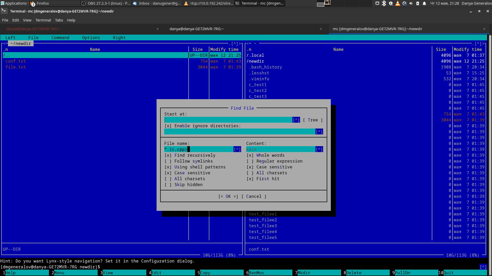

---
## Front matter
lang: ru-RU
title: Лабораторная работа 7
author: |
  Генералов Даниил, НПИ-01-21, 1032212280
institute: |
	\inst{1}RUDN University, Moscow, Russian Federation
date: 13 May, 2022 

## Formatting
toc: false
slide_level: 2
theme: metropolis
header-includes: 
 - \metroset{progressbar=frametitle,sectionpage=progressbar,numbering=fraction}
 - '\makeatletter'
 - '\beamer@ignorenonframefalse'
 - '\makeatother'
aspectratio: 43
section-titles: true
---

# Цель работы

Освоение основных возможностей командной оболочки Midnight Commander. Приобретение навыков практической работы по просмотру каталогов и файлов; манипуляций с ними

## Задачи

- Движение по дереву директорий
- Копирование и перемещение
- Создание папок
- Редактирование файлов

# Ход работы

## Базовые операции

Midnight Commander открывается с двумя панелями, показывающими содержимое текущей директории. Можно двигать курсором в них и нажимать Enter, чтобы входить в подкаталоги.

Команды `Copy` и `RenMov` копируют и перемещают файлы и папки, `Mkdir` создаёт папку, `Delete` удаляет файлы и папки.

## Настройка панелей

Каждая из двух панелей может быть настроена из меню `PullDn/Left` и `PullDn/Right`. У них есть 4 режима:

- File listing -- просмотр каталога
- Quick view -- просмотр файла, выделенного в другой панели
- Info -- информация о файле, выделенном в другой панели
- Tree -- просмотр дерева каталогов

## Поиск

Можно искать файлы по их названию и/или содержимому. Например, можно найти все файлы, которые имеют название, заканчивающиеся на `.c` или `.cpp`, и содержащие слово `main` (рис. [-@fig:001]).

{ #fig:001 width=70% }

## Редактор

Вместе с `mc` есть редактор `mcedit`, который позволяет редактировать файлы в окружении, похожем на `mc`.

Рассмотренные функции:

- Ввод текста
- Копирование и перемещение
- Переход по строке и в начало и в конец
- Подсветка синтаксиса

# Вывод

Мы рассмотрели, как пользоваться Midnight Commander и его встроенным текстовым редактором.
Хотя это не является необходимым навыком, поскольку все те же самые действия можно осуществлять из командной строки,
это тем не менее иногда удобнее.
В частности, как и с любым не-консольным интерфейсом, можно легко узнать все возможности, прочитав список из меню.
Благодаря этому программа `mc` станет полезным дополнением к нашему набору инструментов.