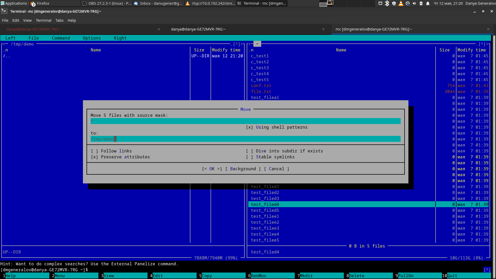
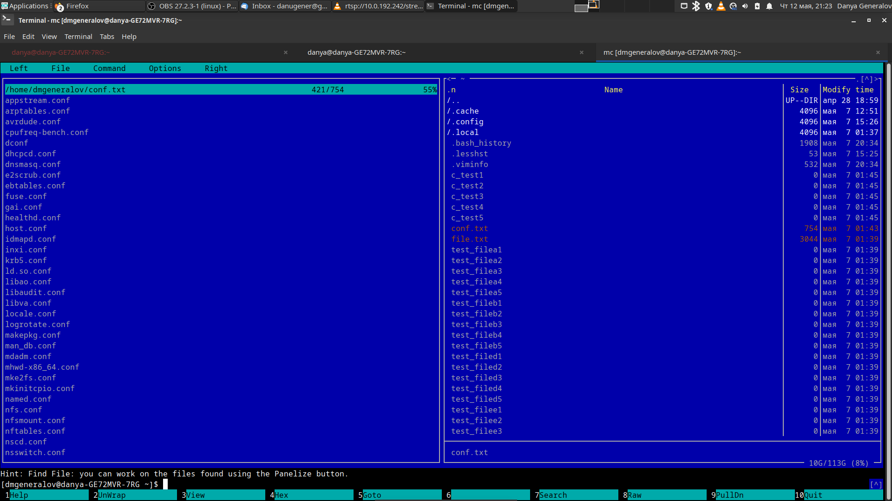
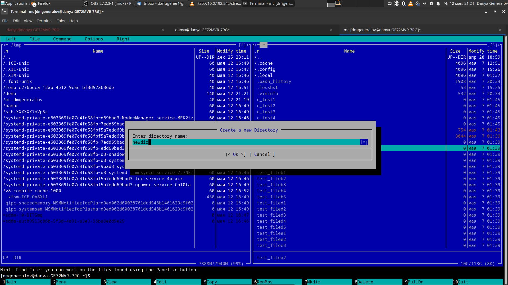
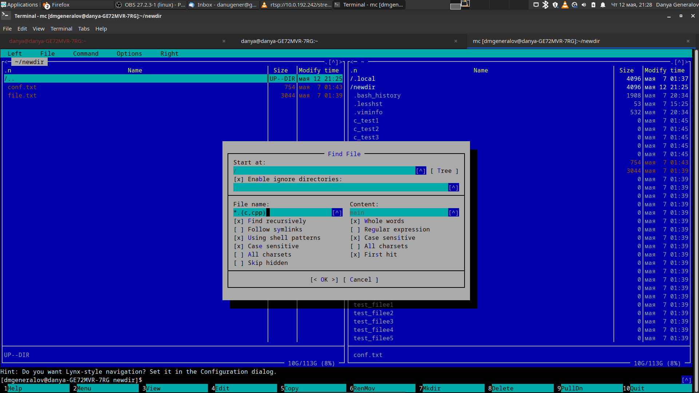

---
## Front matter
title: "Лабораторная работа 7"
subtitle: "Командная оболочка Midnight Commander"
author: "Генералов Даниил, НПИ-01-21, 1032212280"

## Generic otions
lang: ru-RU
toc-title: "Содержание"

## Bibliography
bibliography: bib/cite.bib
csl: pandoc/csl/gost-r-7-0-5-2008-numeric.csl

## Pdf output format
toc: true # Table of contents
toc-depth: 2
lof: true # List of figures
lot: true # List of tables
fontsize: 12pt
linestretch: 1.5
papersize: a4
documentclass: scrreprt
## I18n polyglossia
polyglossia-lang:
  name: russian
  options:
	- spelling=modern
	- babelshorthands=true
polyglossia-otherlangs:
  name: english
## I18n babel
babel-lang: russian
babel-otherlangs: english
## Fonts
mainfont: PT Serif
romanfont: PT Serif
sansfont: PT Sans
monofont: PT Mono
mainfontoptions: Ligatures=TeX
romanfontoptions: Ligatures=TeX
sansfontoptions: Ligatures=TeX,Scale=MatchLowercase
monofontoptions: Scale=MatchLowercase,Scale=0.9
## Biblatex
biblatex: true
biblio-style: "gost-numeric"
biblatexoptions:
  - parentracker=true
  - backend=biber
  - hyperref=auto
  - language=auto
  - autolang=other*
  - citestyle=gost-numeric
## Pandoc-crossref LaTeX customization
figureTitle: "Рис."
tableTitle: "Таблица"
listingTitle: "Листинг"
lofTitle: "Список иллюстраций"
lotTitle: "Список таблиц"
lolTitle: "Листинги"
## Misc options
indent: true
header-includes:
  - \usepackage{indentfirst}
  - \usepackage{float} # keep figures where there are in the text
  - \floatplacement{figure}{H} # keep figures where there are in the text
---

# Цель работы

Целью данной работы является освоение основных возможностей командной оболочки Midnight Commander, приобретение навыков практической работы по просмотру каталогов и файлов и манипуляций с ними

# Задание

В рамках работы нужно: 

- Изучить процесс выполнения базовых файловых операций в mc
- Освоить редактирование текста в встроенном редакторе mc

# Теоретическое введение

Midnight Commander -- это файловый менеджер и обозреватель директорий для Unix-подобных файловых систем, наследующий свой интерфейс от проектов вроде Norton Commander и FAR Manager, которые выполняли подобные задачи на других ОС. Используя подобные программы, можно взаимодействовать с файловой системой более интуитивно, чем через командную строку.

# Выполнение лабораторной работы

Сначала мы читаем man-страницу для mc на рис. [-@fig:001], а после этого мы можем запустить mc в домашней директории и увидеть интерфейс, похожий на рис. [-@fig:002].

{ #fig:001 width=70% }

{ #fig:002 width=70% }

Интерфейс состоит из двух панелей, содержимое которых можно менять.
По умолчанию панель содержит список файлов, и эти файлы можно выделять, нажав на клавишу `+` и вводя название, которое нужно добавить к выделению (рис. [-@fig:003]).
Когда файлы выделены, их можно передвинуть или копировать (рис. [-@fig:004]).
Другие варианты содержимого панели -- детальная информация о файле под курсором (рис. [-@fig:005]) или быстрый просмотр файла (рис. [-@fig:006]).
Файлы также можно открывать и редактировать во встроенном редакторе (рис. [-@fig:007] и [-@fig:008]), и мы рассмотрим это потом.

{ #fig:003 width=70% }

{ #fig:004 width=70% }

{ #fig:005 width=70% }

{ #fig:006 width=70% }

{ #fig:007 width=70% }

{ #fig:008 width=70% }

После этого нужно создать директорию (рис. [-@fig:009]) и добавить в нее файлы (рис. [-@fig:010]).

{ #fig:009 width=70% }

{ #fig:010 width=70% }

Среди других функций mc, которые можно найти в меню `Command` -- поиск файлов. На рис. [-@fig:011] показано, как можно выполнить поиск по названию файла, а также по его содержимому, и результаты поиска показаны в окне на рис. [-@fig:012].

{ #fig:011 width=70% }

{ #fig:012 width=70% }

Можно посмотреть историю комманд, введенных во встроенной командной строке (рис. [-@fig:013]), или посмотреть дерево каталогов (рис. [-@fig:014]).

{ #fig:013 width=70% }

{ #fig:014 width=70% }

Также в меню `Command` есть опции редактирования файла команд пользователя (рис. [-@fig:015]) и файла расширений (рис. [-@fig:016]).
Файл команд описывает команды в меню команд, для каждой из них указывая, над какими файлами можно применить её и какие действия нужно выполнить при этом.
Файл расширений указывает, для каждого расширения файла, какие действия нужно сделать, когда к этому файлу применяется команда `Open` или `View`.

{ #fig:015 width=70% }

{ #fig:016 width=70% }

Для более детальной конфигурации можно использовать окно настроек (рис. [-@fig:017]).

{ #fig:017 width=70% }

Теперь пришло время рассмотреть встроенный редактор текста. Чтобы начать, я взял файл, содержащий man-страницу для mc (рис. [-@fig:018]).

{ #fig:018 width=70% }

Можно выделить кусок текста командой `Mark`, затем дублировать его командой `Copy` (рис. [-@fig:019]), или передвинуть его в другое место командой `Move` (рис. [-@fig:020]).

{ #fig:019 width=70% }

{ #fig:020 width=70% }

Используя команду `PullDn/Edit/Undo`, можно отменить последнее действие и вернуть документ к предыдущему состоянию (рис. [-@fig:021]).

{ #fig:021 width=70% }

Можно перейти в конец (рис. [-@fig:022]), или в начало (рис. [-@fig:023]) документа, используя команду `PullDn/Edit/End` или `PullDn/Edit/Beginning`, или же используя `PullDn/Command/Go to line...` на строчку `1` для начала и `-1` для конца.

{ #fig:022 width=70% }

{ #fig:023 width=70% }

Для файлов с кодом, вроде исходного файла Rust на рис. [-@fig:024], по умолчанию включена подсветка синтаксиса. Её можно включить или выключить из меню настроек (рис. [-@fig:025]).

{ #fig:024 width=70% }

{ #fig:025 width=70% }

# Контрольные вопросы

1. Какие режимы работы есть в mc. Охарактеризуйте их.

Каждая из двух панелей может быть в одном из четырех режимов:

- File listing -- показывает содержимое одного каталога в формате таблицы и позволяет переходить между каталогами
- Quick view -- просмотр текстового файла, выделенного в другой панели
- Info -- подробная информация о файле, выделенном в другой панели (название, номер inode, биты разрешения, владелец, размер, время изменения и т.д.)
- Tree -- дерево каталогов, по которому можно двигаться и изменять директорию другой панели

2. Какие операции с файлами можно выполнить как с помощью команд shell, так и с помощью меню (комбинаций клавиш) mc? Приведите несколько примеров.

Почти все операции `mc` имеют аналоги в форме команд. Например:

- просмотр директорий и файлов в каталоге: `ls` или панель `PullDn/Left/File listing`
- просмотр файла: `less` или `F3 View`
- просмотр дерева директорий: `tree` или панель `PullDn/Left/Tree`
- создание директории: `mkdir` или `F7 Mkdir`
- удаление файлов и директорий: `rm -r` или `F8 Delete`
- переименование и перемещение файлов и директорий: `mv` или `F6 RenMov`
- копирование файлов и директорий: `cp` или `F5 Copy`

3. Опишите структура меню левой (или правой) панели mc, дайте характеристику командам.

Помимо четырех опций для содержимого панели, в этом меню есть:

- Listing format... -- изменяет формат отображения списка файлов
- Sort order... -- изменяет порядок отображения файлов
- Filter... -- показывает только файлы, которые соответствуют указанному фильтру
- Encoding... -- изменяет кодировку для интерпретации названия файлов
- FTP link..., Shell link..., SFTP link... -- подключиться к удаленному компьютеру в этой панели
- Panelize -- показать все файлы в списке файлов (например из поиска) в этой панели
- Rescan -- пересканировать каталог и обновить список файлов

4. Опишите структура меню Файл mc, дайте характеристику командам.

- View -- посмотреть файл под курсором
- View file... -- посмотреть файл по имени
- Filtered view... -- выполнить команду и посмотреть ее вывод
- Edit -- открыть файл в редакторе
- Copy -- Копировать файл
- Chmod -- изменить разрешения файла
- Link -- создать жесткую ссылку
- Symlink -- создать символическую ссылку с абсолютным путем
- Relative symlink -- создать символическую ссылку с относительным путем
- Edit symlink -- отредактировать указатель символической ссылки
- Chown -- изменить владельца файла
- Advanced chown -- одновременно изменить владельца файла и разрешения
- Chattr -- изменить особые аттрибуты файлов
- Rename/Move -- переименовать или переместить файл
- Mkdir -- создать директорию
- Delete -- удалить файл
- Quick cd -- перейти в директорию в панели по имени 
- Select group, Unselect group, Invert selection -- манипулировать группой выделения
- Exit -- выйти из программы

5. Опишите структура меню Команда mc, дайте характеристику командам.

- User menu -- пользовательские команды
- Directory tree -- открыть дерево каталогов
- Find file -- найти файл по названию или содержимому
- Swap panels -- поменять местами панели
- Switch panels on/off -- скрыть панели и перейти к простой командной строке
- Compare directories -- выделить отличающиеся файлы в панелях
- Compare files -- сравнить два файла
- External panelize -- вывести в одну панель все файлы, пути к которым выведет указанная команда
- Show directory sizes -- просканировать директории и вывести размеры их содержимого вместо размеров самих директорий
- Command history -- посмотреть список команд, введенных вручную
- Viewed/edited files history -- посмотреть список последних открытых файлов
- Directory hotlist -- список любимых директорий
- Active VFS list -- список активных виртуальных файловых систем внутри mc
- Background jobs -- список задач в консоли, выполняемых в фоне
- Screen list -- список открытых экранов с панелями
- Edit extension file/Edit menu file/Edit highlighting group file -- редактировать файлы с инструкциями по действиям над отдельными типами файлов

6. Опишите структура меню Настройки mc, дайте характеристику командам.

- Configuration... -- общие настройки
- Layout... -- настройка геометрии экрана
- Panel options... -- настройка отображения содержимого панели
- Confirmation... -- настройка операций, при которых нужно подтвердить действие
- Appearance... -- выбор внешнего вида программы
- Display bits... -- выбор кодировки терминала
- Learn keys... -- настройка доступных клавиш на клавиатуре
- Virtual FS... -- настройка виртуальных файловых систем
- Save setup -- использовать эти настройки при запуске программы

7. Назовите и дайте характеристику встроенным командам mc.

- Help -- открыть индекс онлайн-документации
- Menu -- открыть меню пользовательских команд
- View -- открыть файл для просмотра
- Edit -- открыть файл для редактирования
- Copy -- копировать файлы или директории
- RenMov -- переименовать или переместить файлы или директории
- Mkdir -- создать директорию
- Delete -- удалить файлы или директории
- PullDn -- переместить курсор на панель меню наверху экрана
- Quit -- закрыть программу

8. Назовите и дайте характеристику командам встроенного редактора mc.
- Help -- открыть индекс онлайн-документации
- Save -- сохранить текущий буфер
- Mark -- начать выделение
- Replac -- заменить текст в буфере
- Copy -- сделать копию выделенного текста
- Move -- вырезать выделенный текст и вставить его в другое место
- Search -- найти текст в буфере
- Delete -- удалить выделенный текст
- PullDn -- переместить курсор на панель меню наверху экрана
- Quit -- закрыть программу

9. Дайте характеристику средствам mc, которые позволяют создавать меню, определяемые пользователем.

Команды пользовательского меню позволяют выполнять определенные действия над файлами и директориями.
Эти команды хранятся в файле `.mc.menu`.
Для каждой команды, первая строчка указывает, с какими файлами она может работать, вторая указывает сокращение команды и ее название, а остальные строчки указывают действия, которые нужно выполнить для этой команды.

10. Дайте характеристику средствам mc, которые позволяют выполнять действия, определяемые пользователем, над текущим файлом.

Посредством файла расширений пользователь может задавать смысл команд `Open` и `View` для конкретных типов файлов.
Информация об этих действиях хранится в файле `mc.ext`.
Сначала идет строчка, которая описывает, каким именно образом следует проверить, является ли этот файл экземпляром этого типа.
После этого идут строки, которые указывают команды, которые нужно выполнить для этих двух операций.

# Заключение

Мы рассмотрели, как пользоваться Midnight Commander и его встроенным текстовым редактором.
Хотя это не является необходимым навыком, поскольку все те же самые действия можно осуществлять из командной строки,
это тем не менее иногда удобнее.
В частности, как и с любым не-консольным интерфейсом, можно легко узнать все возможности, прочитав список из меню.
Благодаря этому программа mc станет полезным дополнением к нашему набору инструментов.