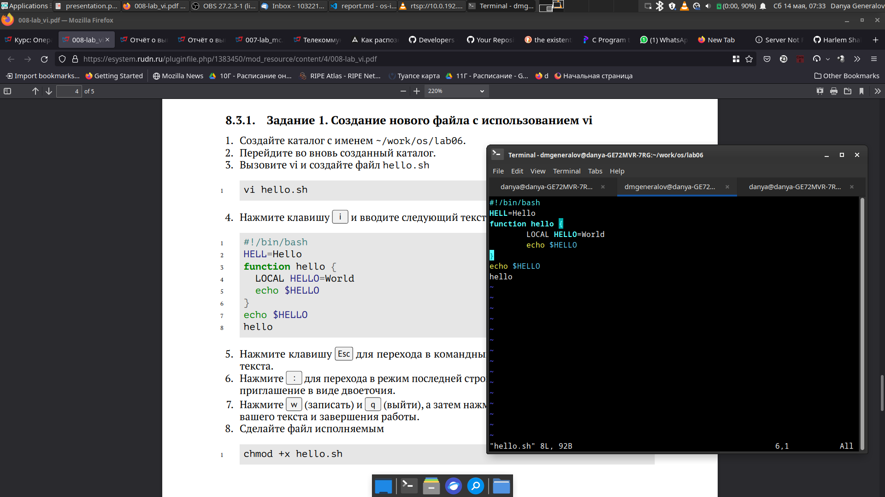

---
## Front matter
lang: ru-RU
title: Лабораторная работа 8
author: |
  Генералов Даниил, НПИ-01-21, 10322122800
institute: |
	\inst{1}RUDN University, Moscow, Russian Federation
date: 14 May, 2022

## Formatting
toc: false
slide_level: 2
theme: metropolis
header-includes: 
 - \metroset{progressbar=frametitle,sectionpage=progressbar,numbering=fraction}
 - '\makeatletter'
 - '\beamer@ignorenonframefalse'
 - '\makeatother'
aspectratio: 43
section-titles: true
---

# Цель и задачи

Познакомиться с операционной системой Linux. Получить практические навыки работы с редактором vi, установленным по умолчанию практически во всех дистрибутивах.

## Задачи

- Создать текст в VI
- Сохранить файл
- Открыть файл и отредактировать его

# Выполнение работы

## Создание текста

Чтобы создать файл с текстом, нужно открыть (возможно несуществующий) файл в `vi`, войти в режим ввода текста клавишей `i`,
затем написать текст.

После того как текст введен, нужно вернуться в стандартный режим клавишей `Esc` и нажать `:wq`, чтобы сохранить и закрыть.

{ #fig:001 width=70% }

## Редактирование текста

Для редактирования используются разные команды, вроде `r` для замены, `d` для удаления, `i` для ввода и `g` для движения по файлу.

Примененные изменения:
- добавление буквы внутрь строки
- добавление новой строки в конец файла
- изменение регистра букв в слове

Для отмены изменений можно использовать команду `u`, которая отменяет последнее действие.

# Заключение

Мы попробовали воспользоваться текстовым редактором VI, который присутствует на многих системах и поэтому полезен для редактирования текста вроде конфигурационных файлов.
Используя этот редактор, можно писать текст, а также редактировать его с помощью широкого набора команд.
Из-за этого широкого набора команд, этот редактор сложно использовать в полную силу, но теперь мы имеем достаточное представление о нем, чтобы иметь возможность использовать его на базовом уровне.