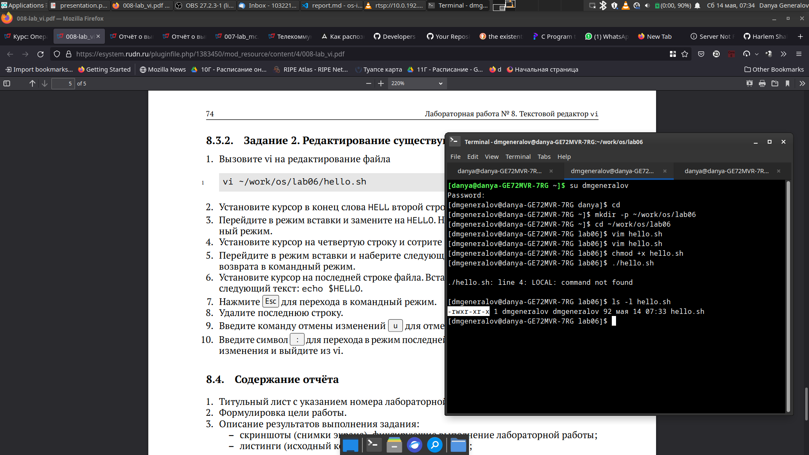

---
## Front matter
title: "Лабораторная работа 7"
subtitle: "Текстовой редактор vi"
author: "Генералов Даниил, НПИ-01-21, 1032212280"

## Generic otions
lang: ru-RU
toc-title: "Содержание"

## Bibliography
bibliography: bib/cite.bib
csl: pandoc/csl/gost-r-7-0-5-2008-numeric.csl

## Pdf output format
toc: true # Table of contents
toc-depth: 2
lof: true # List of figures
lot: true # List of tables
fontsize: 12pt
linestretch: 1.5
papersize: a4
documentclass: scrreprt
## I18n polyglossia
polyglossia-lang:
  name: russian
  options:
	- spelling=modern
	- babelshorthands=true
polyglossia-otherlangs:
  name: english
## I18n babel
babel-lang: russian
babel-otherlangs: english
## Fonts
mainfont: PT Serif
romanfont: PT Serif
sansfont: PT Sans
monofont: PT Mono
mainfontoptions: Ligatures=TeX
romanfontoptions: Ligatures=TeX
sansfontoptions: Ligatures=TeX,Scale=MatchLowercase
monofontoptions: Scale=MatchLowercase,Scale=0.9
## Biblatex
biblatex: true
biblio-style: "gost-numeric"
biblatexoptions:
  - parentracker=true
  - backend=biber
  - hyperref=auto
  - language=auto
  - autolang=other*
  - citestyle=gost-numeric
## Pandoc-crossref LaTeX customization
figureTitle: "Рис."
tableTitle: "Таблица"
listingTitle: "Листинг"
lofTitle: "Список иллюстраций"
lotTitle: "Список таблиц"
lolTitle: "Листинги"
## Misc options
indent: true
header-includes:
  - \usepackage{indentfirst}
  - \usepackage{float} # keep figures where there are in the text
  - \floatplacement{figure}{H} # keep figures where there are in the text
---

# Цель работы

Целью данной работы является: 

> Познакомиться с операционной системой Linux. Получить практические навыки работы с редактором vi, установленным по умолчанию практически во всех дистрибутивах.

# Задание

Требуется сделать следующее:

- Ввести текст в редактор и сохранить его;
- Сделать файл с текстом исполняемым;
- Исправить ошибки в коде.


# Теоретическое введение

VI -- это текстовый редактор с полноэкранным визуальным интерфейсом.
Как замечено в задании, он присутствует в той или иной форме на большинстве Unix-подобных систем,
включая настольные и серверные дистрибутивы Linux, Mac OS X/macOS, а также иногда на встраиваемых системах вроде роутеров.
Из-за своей распространенности, а также из-за его возможностей, полезно знать как именно использовать его для ввода текста.

# Выполнение лабораторной работы

Сначала нужно создать текстовый документ с указанным содержимым. Для этого нужно сначала запустить редактор, затем перевести его в режим редактирования нажатием клавиши `i`. После этого можно ввести текст, и когда ввод закончен, можно закрыть режим редактирования клавишой `Esc`. Состояние окна после этого видно на рис. [-@fig:001].

{ #fig:001 width=70% }

После этого нужно закрыть редактор, сначала нажав клавишу `:`, чтобы перейти в режим ввода команд, а затем ввести `wq` для сохранения текста и выхода из редактора. После этого нужно сделать текстовый файл исполняемым, однако сейчас он не будет работать из-за синтаксических ошибок, как показано на рис. [-@fig:002].

{ #fig:002 width=70% }

Для того, чтобы исправить ошибки, нужно изменить некоторые строки. Для этого можно пользоваться режимом вставки, а также командами редактирования текста вроде `s/LOCAL/local`. Также можно опробовать команду удаления строки, `dd`, и команду отмены, `u`. Итоговое состояние текста видно на рис. [-@fig:003].

{ #fig:003 width=70% }

После этого можно сохранить этот файл снова и попробовать его выполнить -- на этот раз он запускается правильно, как на рис. [-@fig:004].

{ #fig:004 width=70% }

# Контрольные вопросы

1. Дайте краткую характеристику режимам работы редактора vi.

- Командный режим -- режим по умолчанию, позволяющий просматривать файл, выполнять команды клавишами и переходить в другие режимы
- Режим ввода команд -- позволяет вводить команды, описанные текстом, в том числе команды сохранения и выхода
- Режим вставки -- позволяет вводить и удалять текст, написанный вручную, в открытый файл
- Визуальный режим -- позволяет выделять кусок текста по отрезку, прямоугольнику или по строчкам, и выполнять те же самые действия, как и в командном режиме.

2. Как выйти из редактора, не сохраняя произведённые изменения?

Для этого нужно зайти в режим ввода команд, нажав `:`, а затем ввести `qa!`, что закроет все окна и выйдет из редактора без сохранения изменений.
Можно узнать это, если нажать `Ctrl+C` в командном режиме.

3. Назовите и дайте краткую характеристику командам позиционирования.
Команды позиционирования используются в командном режиме, чтобы перемещать курсор в файле.
Для нас полезны следующие команды:

- `0` -- перемещает курсор в начало строки
- `$` -- перемещает курсор в конец строки
- `G` -- перемещает курсор в конец файла
- `gg` -- перемещает курсор в начало файла
- `<n>G` -- перемещает курсор в конец строки с номером `n`, где начальная строка файла имеет номер 1


4. Что для редактора vi является словом?

В контексте команд `W` и `B`, которые переходят по словам влево и вправо, слово -- эта любая последовательность знаков, разделенная пробелом, знаком табуляции или знаком переноса строки. Для команд `w` и `b`, спецсимволы воспринимаются как пробельные символы и не считаются частью слова. 

5. Каким образом из любого места редактируемого файла перейти в начало (конец) файла?

Для этого можно использовать команду `1G`, которая переходит на первую строку, и `G`, которая переходит на последнюю строку.

6. Назовите и дайте краткую характеристику основным группам команд редактирования.

Существуют следующие группы команд:

- вставка текста внутри строки: `i`, `I` `a`, `A`
- вставка текста на новую строку: `o`, `O`
- удаление текста: `x`, `d`
- передвижение в истории изменений: `u`, `Ctrl+R`
- работа с буфером обмена: `y`, `Y`, `p`, `P`
- замена текста: `r`, `R`, `c`
- поиск: `/`, `?`

7. Необходимо заполнить строку символами $. Каковы ваши действия?

Используя стандартную ширину строки в 80 колонок, можно набрать команду `80i`, нажать клавишу `$`, затем выйти из режима ввода через `Esc`, чтобы получить 80 символов `$` в строке.

8. Как отменить некорректное действие, связанное с процессом редактирования?

Чтобы отменить последнее изменение, можно использовать команду `u`.
Чтобы отменить отмену изменения, можно использовать команду `Ctrl+r`.

9. Назовите и дайте характеристику основным группам команд режима последней строки.

В режиме ввода команд можно делать очень много различных действий. Можно даже делать собственные команды, выполняющие полезные наборы действий. Однако самые часто употребимые команды -- это:

- `w`, `wq`, `q!` -- для записи в файл, записи и выхода из программы, или выхода без записи
- `set` -- для изменения настроек программы
- `d`, `m`, `t` -- для редактирования наборов строк по номерам
- `split`, `vsplit`, `term`, `close` -- для управления окнами
- `help`, `help <topic>` -- для получения помощи по командам или по теме 

10. Как определить, не перемещая курсора, позицию, в которой заканчивается строка?

Иными словами, нужно определить, какая длина текущей строки.
Для этого можно использовать команду `:.w !wc -c`. 
Эта команда передаст текущую строчку на вход команде `wc -c`, которая посчитает количество символов во входном потоке.

11. Выполните анализ опций редактора vi (сколько их, как узнать их назначение и т.д.).

Согласно man-странице по `vi` на моей системе, программа принимает следующие 8 опций командной строки: `-c`, `-l`, `-r`, `-R`, `-s`, `-t`, `-V` и `-w`. Некоторые из этих опций используются для того, чтобы использовать `vi` в неинтерактивном режиме, а некоторые устанавливают настройки, которые используются для изменения поведения `vi` в пользовательском режиме -- чтобы определить, что именно делает какая опция, нужно посмотреть man-страницу.

12. Как определить режим работы редактора vi?

Текущий активный режим можно узнать по надписи внизу экрана -- если нет текста, это командный режим, если есть один знак `:` -- режим ввода команд, если есть слово `INSERT` -- режим вставки, а если есть слово `VISUAL` -- визуальный режим.

13. Постройте граф взаимосвязи режимов работы редактора vi.

```
Начало -> Командный режим
Командный режим -[клавиша i]> Режим вставки
Командный режим -[клавиша o]> Режим вставки
Режим вставки -[клавиша Esc]> Командный режим

Командный режим -[клавиша :]> Режим ввода команд
Режим ввода команд -[клавиша Enter]> Командный режим
Режим ввода команд -[клавиша Esc]> Командный режим
Командный режим -[клавиша :]> Режим ввода команд
Режим ввода команд -[qa!]> Конец

Командный режим -[клавиша v]> Визуальный режим
Командный режим -[клавиша V]> Визуальный режим (строками)
Командный режим -[Ctrl+V]> Визуальный режим (прямоугольником)
Визуальный режим -[клавиша Esc]> Командный режим

Командный режим -[клавиша Esc]> Командный режим
```

# Выводы

Мы попробовали воспользоваться текстовым редактором VI, который присутствует на многих системах и поэтому полезен для редактирования текста вроде конфигурационных файлов.
Используя этот редактор, можно писать текст, а также редактировать его с помощью широкого набора команд.
Из-за этого широкого набора команд, этот редактор сложно использовать в полную силу, но теперь мы имеем достаточное представление о нем, чтобы иметь возможность использовать его на базовом уровне.