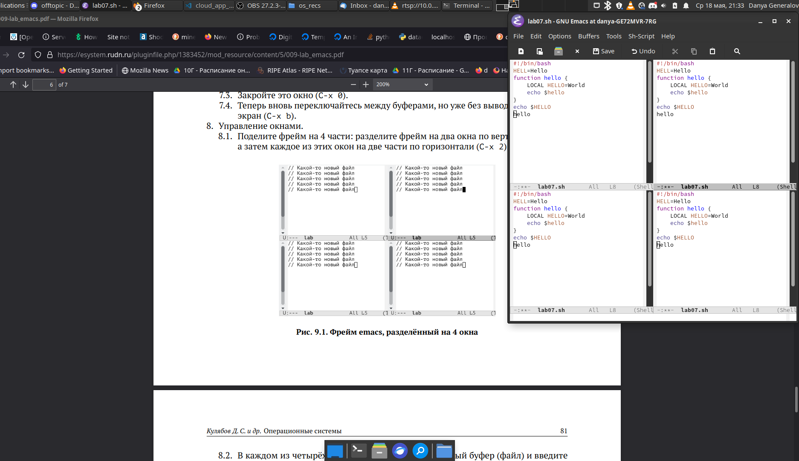

---
## Front matter
lang: ru-RU
title: Лабораторная работа 9
author: |
  Генералов Даниил, НПИ-01-21, 10322122800
institute: |
	\inst{1}RUDN University, Moscow, Russian Federation
date: 19 May, 2022

## Formatting
toc: false
slide_level: 2
theme: metropolis
header-includes: 
 - \metroset{progressbar=frametitle,sectionpage=progressbar,numbering=fraction}
 - '\makeatletter'
 - '\beamer@ignorenonframefalse'
 - '\makeatother'
aspectratio: 43
section-titles: true
---

# Цель и задачи

Познакомиться с операционной системой Linux. Получить практические навыки работы с редактором Emacs.

## Задачи

- Написать текст в файл
- Отредактировать текст
- Использовать окна
- Попробовать поиск

# Выполнение работы

## Написание текста

- Открыть Emacs

- Открыть файл: `C-x C-f`

- Написать текст

- Сохранить файл: `C-x C-s`

## Редактирование текста

- Вырезать строку до конца: `C-k`

- Вставить: `C-y`

- Выделить текст: `C-space`

- Скопировать в *kill-буфер*: `M-w`

- Отменить действие: `C-/`

Переместить курсор:

- в начало строки: `C-a`

- в конец строки: `C-e`

- в начало буфера: `M-<`

- в конец буфера: `M->`

## Окна

Разделить окна: `C-x 2` и `C-x 3`

Закрыть окна: `C-x 0`

{ #fig:001 width=70% }

# Заключение

Emacs -- это редактор с широкими возможностями для расширения, что делает его очень настраиваемым.
Благодаря широкому набору возможностей его можно считать одним из первых IDE.

Как и VI, редактор имеет много различных возможностей, но их сложно использовать в полную силу, и требуется потратить время на изучение.
В этой работе мы познакомились с самым базовым функционалом.