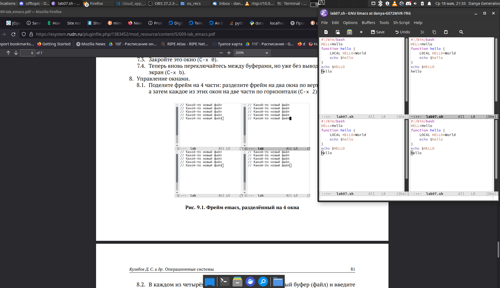

---
## Front matter
title: "Лабораторная работа 9"
subtitle: "Текстовой редактор Emacs"
author: "Генералов Даниил, НПИ-01-21, 1032212280"

## Generic otions
lang: ru-RU
toc-title: "Содержание"

## Bibliography
bibliography: bib/cite.bib
csl: pandoc/csl/gost-r-7-0-5-2008-numeric.csl

## Pdf output format
toc: true # Table of contents
toc-depth: 2
lof: true # List of figures
lot: true # List of tables
fontsize: 12pt
linestretch: 1.5
papersize: a4
documentclass: scrreprt
## I18n polyglossia
polyglossia-lang:
  name: russian
  options:
	- spelling=modern
	- babelshorthands=true
polyglossia-otherlangs:
  name: english
## I18n babel
babel-lang: russian
babel-otherlangs: english
## Fonts
mainfont: PT Serif
romanfont: PT Serif
sansfont: PT Sans
monofont: PT Mono
mainfontoptions: Ligatures=TeX
romanfontoptions: Ligatures=TeX
sansfontoptions: Ligatures=TeX,Scale=MatchLowercase
monofontoptions: Scale=MatchLowercase,Scale=0.9
## Biblatex
biblatex: true
biblio-style: "gost-numeric"
biblatexoptions:
  - parentracker=true
  - backend=biber
  - hyperref=auto
  - language=auto
  - autolang=other*
  - citestyle=gost-numeric
## Pandoc-crossref LaTeX customization
figureTitle: "Рис."
tableTitle: "Таблица"
listingTitle: "Листинг"
lofTitle: "Список иллюстраций"
lotTitle: "Список таблиц"
lolTitle: "Листинги"
## Misc options
indent: true
header-includes:
  - \usepackage{indentfirst}
  - \usepackage{float} # keep figures where there are in the text
  - \floatplacement{figure}{H} # keep figures where there are in the text
---

# Цель работы

Целью данной работы является: 

> Познакомиться с операционной системой Linux. Получить практические навыки работы с редактором Emacs.

# Задание

Требуется сделать следующее:

- Ввести текст в редактор и сохранить его;
- Изменить текст и опробовать команды редактирования;
- Опробовать команды поиска и управления окнами.

# Теоретическое введение

Emacs -- это текстовый редактор с широкими возможностями расширения и модификации.
Он написан на языке Lisp, который является одним из первых функциональных языков программирования,
и он имеет некоторый функционал для более удобного редактирования кода на этом языке.

# Выполнение лабораторной работы

Первым делом нужно установить `emacs`, если он не установлен.
Для этого нужно использовать системный пакетный менеджер (в моем случае -- `pacman`).
При трудностях, как на рис. [-@fig:001], можно попробовать скомпилировать программу из исходного кода.

{ #fig:001 width=70% }

Для первого задания нужно создать текстовый документ с указанным содержимым.
Для этого нужно сначала запустить редактор  (рис. [-@fig:002]) и открыть новый буфер, для этого нажать`C-x C-f` и ввести путь к файлу.
После этого можно ввести текст, как показано на рис. [-@fig:003].

{ #fig:002 width=70% }

{ #fig:003 width=70% }

После того, как мы сохранили документ с помощью `C-x C-s`, можно опробовать команды редактирования текста и передвижения курсора.

Для управления буферами используется набор команд: для просмотра текущих буферов можно использовать команду `C-x C-b`,
которая откроет окно как на рис. [-@fig:004].

{ #fig:004 width=70% }

Чтобы переключаться между окнами, можно использовать команды `C-x o` и `C-x C-o`.
Чтобы закрыть текущее окно, можно использовать команду `C-x 0`.

Чтобы разделить фрейм на окна, можно использовать команды `C-x 2` и `C-x 3`.
Каждое из новых окон может содержать один и тот же документ, как показано на рис. [-@fig:005], или разные, как показано на рис. [-@fig:006].

{ #fig:005 width=70% }

{ #fig:006 width=70% }

Используя команду `C-s`, можно осуществлять поиск по текущему буферу, и это выделяет результат поиска, как показано на рис. [-@fig:007].

{ #fig:007 width=70% }

Режим замены, осуществляемый с `M-%`, сначала позволяет найти текст, а затем заменять его на какой-то другой текст, как показано на рис. [-@fig:008].

{ #fig:008 width=70% }

Есть ещё один режим поиска, открываемый через `M-s o`, который позволяет ввести регулярное выражение, которое затем будет использоваться для поиска.
Результат поиска отображается в отдельном окне, как на рис. [-@fig:009].

{ #fig:009 width=70% }

# Контрольные вопросы

1. Кратко охарактеризуйте редактор emacs.

Редактор Emacs -- это экранный текстовый редактор,
интерфейс которого имеет большой фокус на отсутствие режимов работы, и вместо этого на широкий набор сочетаний клавиш,
позволяющих за небольшое количество нажатий выполнить большинство операций.

2. Какие особенности данного редактора могут сделать его сложным для освоения новичком?

Из-за того, что все операции должны выполняться с помощью комбинаций клавиш, и документация по ним есть в отдельном окне,
иногда бывает трудно вспомнить, как именно называется нужное действие. Это комбинируется с тем, что команды иногда имеют названия,
которые не соответствуют общепринятым мнемоникам (чтобы открыть файл, нужно сделать операцию `C-x C-f`,
от слова `find`, потому что файл нужно найти, чтобы открыть), что делает первый опыт работы с редактором непростым.

3. Своими словами опишите, что такое буфер и окно в терминологии emacs’а.

Буфер -- это область памяти, содержащая текст. Часто буфер содержит файл для редактирования, но там также может быть вывод команды,
текст состояния, меню или другая информация.
Окно -- это одно из разделений экрана ("фрейма"), которое может показывать содержимое буфера, и которое может содержать курсор пользователя.

4. Можно ли открыть больше 10 буферов в одном окне?

В одном окне может быть открыт только один буфер в одно время.
Однако одно окно может переключаться между любым количеством буферов, используя комбинацию клавиш `C-x b` и названия буфера, или с помощью меню `C-x C-b`.

5. Какие буферы создаются по умолчанию при запуске emacs?

Это буфер, содержащий информацию о программе, `scratch`-буфер для временного текста, и буфер для сообщений от различных комманд.

6. Какие клавиши вы нажмёте, чтобы ввести следующую комбинацию C-c | и C-c C-|?

Для первой комбинации нужно нажать `Ctrl`, нажать `С`, отпустить `C`, отпустить `Ctrl`, затем нажать `Shift` и нажать `\`, чтобы ввести `|`.
Для второй комбинации все сделать так же, только после того, как отпустили клавишу `C`, клавишу `Ctrl` отпускать не нужно.

7. Как поделить текущее окно на две части?

Для этого есть команды `C-x 2` и `C-x 3`, которые делят текущее окно на два по горизонтали и по вертикали.

8. В каком файле хранятся настройки редактора emacs?

Они хранятся в файле `~/.emacs`, который можно редактировать вручную или изменить при помощи команды `M-x customize`.

9. Какую функцию выполняет клавиша и можно ли её переназначить?

По умолчанию клавиша `Backspace` используется в редактируемых буферах для удаления символов, а в нередактируемых буферах -- для перехода в начало буфера.

10. Какой редактор вам показался удобнее в работе vi или emacs? Поясните почему.

Лично для меня более удобным показался `vi`, но это только потому, что я начал его использовать раньше, и не проходил встроенный tutorial в Emacs.
Оба редактора довольно трудны в освоении, и для того, чтобы пользоваться ими эффективно, нужно приложить достаточно большие усилия для изучения их.
Поскольку у меня было время для того, чтобы приложить эти усилия в одном, но не в другом случае, то сравнивать по моему мнению само удобство редакторов не возможно.

# Выводы

Мы попробовали воспользоваться текстовым редактором Emacs, который обладает многими возможностями для расширения.
Его расширяемая архитектура делают его очень удобным для выполнения большого количества задач, которые могут быть нужны в процессе написания кода.
Можно сказать, что это один из первых IDE, и его сравнительная компактность и эффективность делают его полезным для работы в ограниченных системах.
Однако даже во времена его большой популярности он получал определенную критику -- часто говорят, что Emacs расширяется как "Eight Megabytes And Constantly Swapping".
Позтому, хотя это полезное дополнение к нашему инструментарю, этот редактор занимает определенную нишу, которая не всегда пересекается с нашей работой.