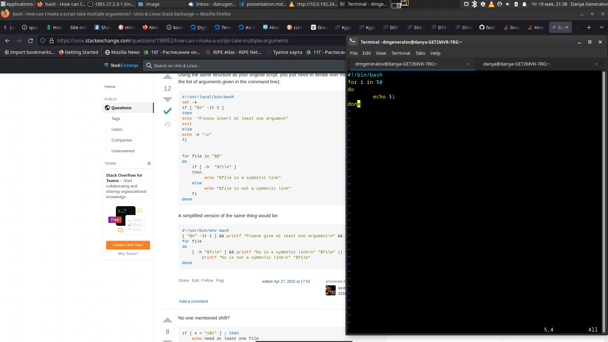
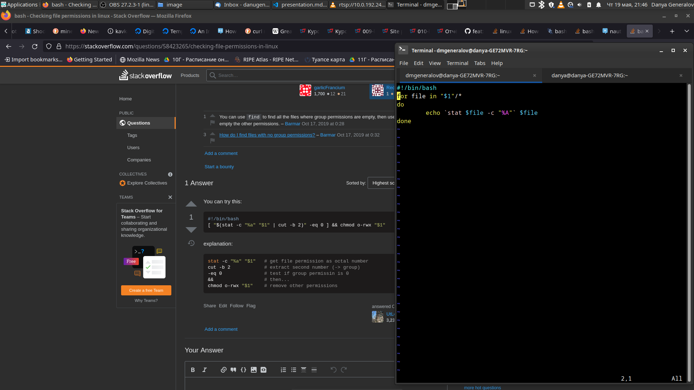
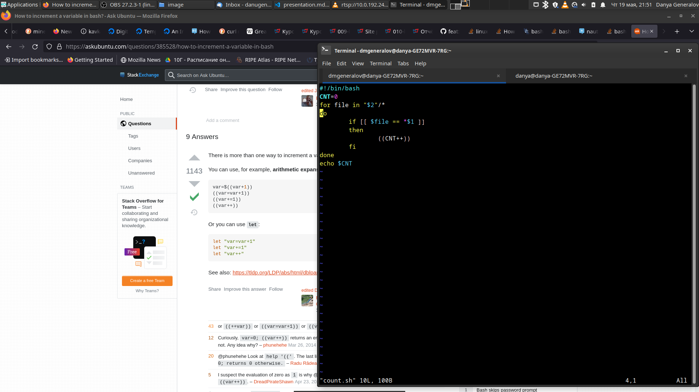

---
## Front matter
lang: ru-RU
title: Лабораторная работа 10
author: |
  Генералов Даниил, НПИ-01-21, 10322122800
institute: |
	\inst{1}RUDN University, Moscow, Russian Federation
date: 20 May, 2022

## Formatting
toc: false
slide_level: 2
theme: metropolis
header-includes: 
 - \metroset{progressbar=frametitle,sectionpage=progressbar,numbering=fraction}
 - '\makeatletter'
 - '\beamer@ignorenonframefalse'
 - '\makeatother'
aspectratio: 43
section-titles: true
---

# Цель и задачи

Изучить основы программирования в оболочке ОС UNIX/Linux. Научиться писать небольшие командные файлы.

## Задачи

Требуется написать 4 командных файла:

- при запуске делает резервную копию себя в папку `~/backup`;
- обрабатывает любое число аргументов и выводит их;
- перечисляет файлы в директории;
- считает количество файлов с определенным расширением.

# Выполнение работы

## Программа для резервного копирования себя

{ #fig:001 width=70% }

## Программа для обработки аргументов

{ #fig:002 width=70% }

## Программа для перечисления файлов в директории

{ #fig:003 width=70% }

## Программа для подсчета файлов с определенным расширением

{ #fig:004 width=70% }

# Заключение

Командные файлы -- это удобный способ писать программы в той же самой среде, в которой работает пользователь.

Используя четыре приведенных примера, можно комбинировать и решать более сложные задачи, не используя других языков программирования.