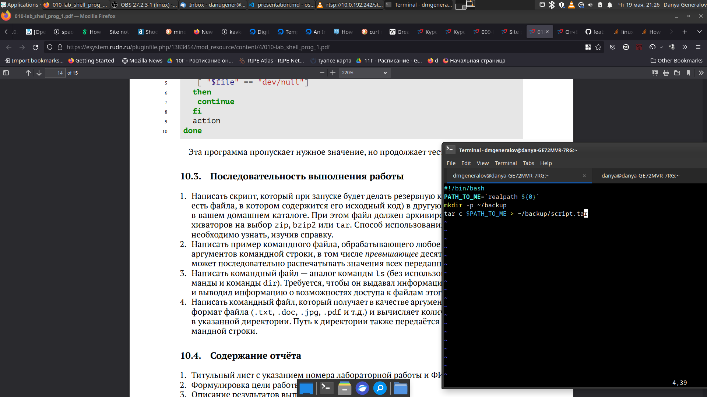
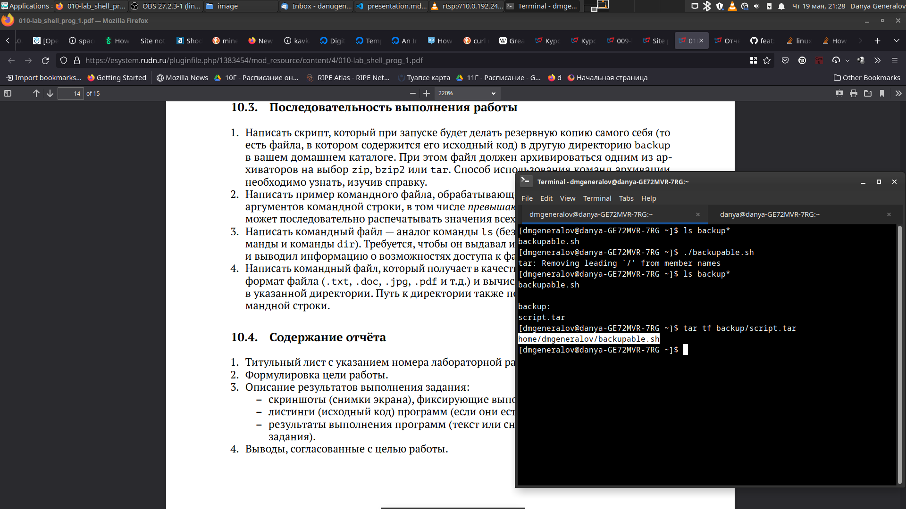
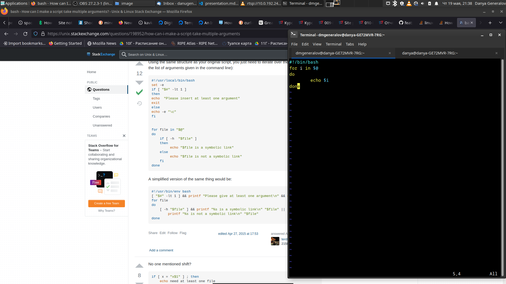
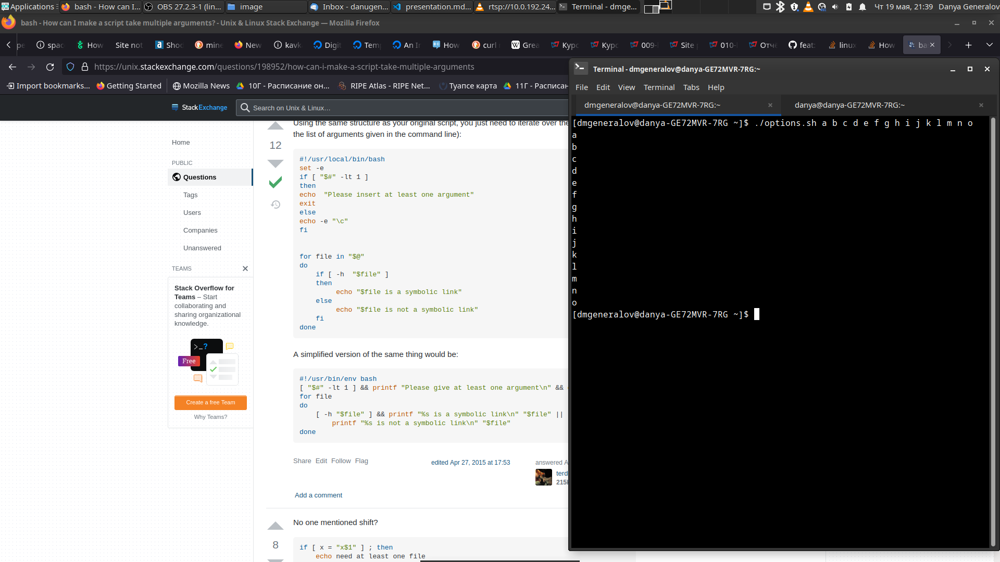
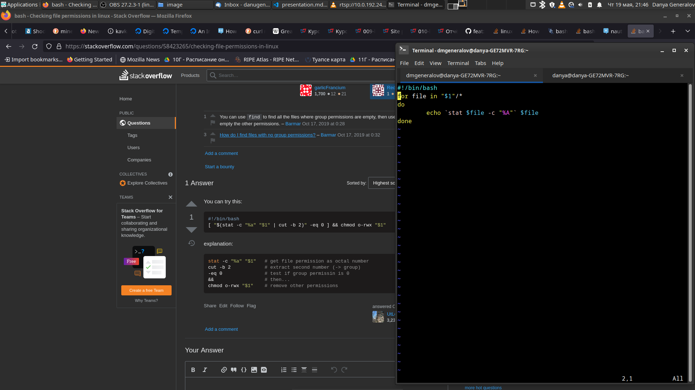
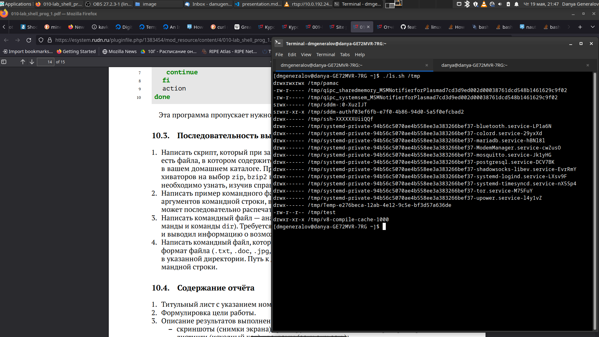
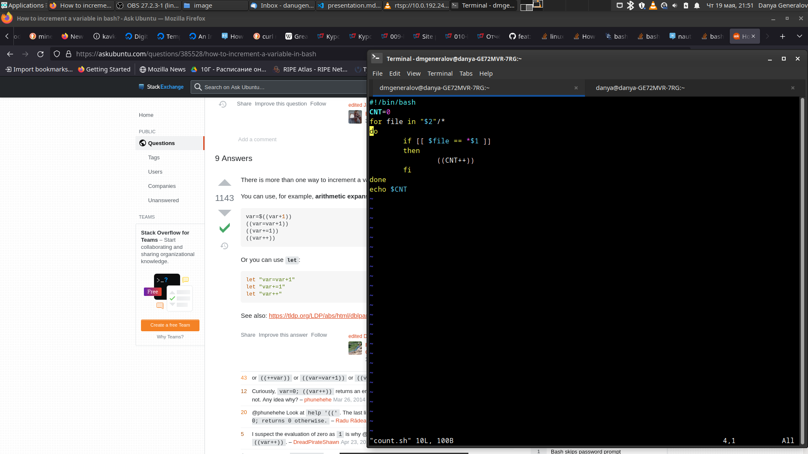
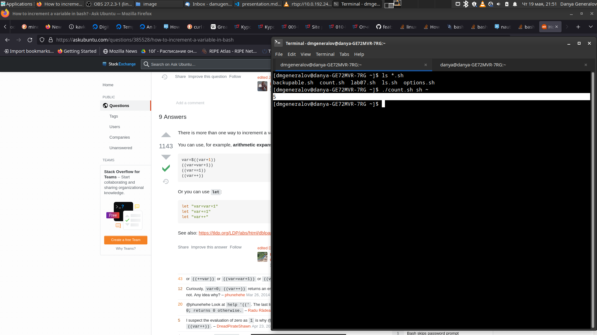

---
## Front matter
title: "Лабораторная работа 10"
subtitle: "Программирование в командном процессоре ОС UNIX. Командные файлы"
author: "Генералов Даниил, НПИ-01-21, 1032212280"

## Generic otions
lang: ru-RU
toc-title: "Содержание"

## Bibliography
bibliography: bib/cite.bib
csl: pandoc/csl/gost-r-7-0-5-2008-numeric.csl

## Pdf output format
toc: true # Table of contents
toc-depth: 2
lof: true # List of figures
lot: true # List of tables
fontsize: 12pt
linestretch: 1.5
papersize: a4
documentclass: scrreprt
## I18n polyglossia
polyglossia-lang:
  name: russian
  options:
	- spelling=modern
	- babelshorthands=true
polyglossia-otherlangs:
  name: english
## I18n babel
babel-lang: russian
babel-otherlangs: english
## Fonts
mainfont: PT Serif
romanfont: PT Serif
sansfont: PT Sans
monofont: PT Mono
mainfontoptions: Ligatures=TeX
romanfontoptions: Ligatures=TeX
sansfontoptions: Ligatures=TeX,Scale=MatchLowercase
monofontoptions: Scale=MatchLowercase,Scale=0.9
## Biblatex
biblatex: true
biblio-style: "gost-numeric"
biblatexoptions:
  - parentracker=true
  - backend=biber
  - hyperref=auto
  - language=auto
  - autolang=other*
  - citestyle=gost-numeric
## Pandoc-crossref LaTeX customization
figureTitle: "Рис."
tableTitle: "Таблица"
listingTitle: "Листинг"
lofTitle: "Список иллюстраций"
lotTitle: "Список таблиц"
lolTitle: "Листинги"
## Misc options
indent: true
header-includes:
  - \usepackage{indentfirst}
  - \usepackage{float} # keep figures where there are in the text
  - \floatplacement{figure}{H} # keep figures where there are in the text
---

# Цель работы

Целью данной работы является: 

> Изучить основы программирования в оболочке ОС UNIX/Linux. Научиться писать небольшие командные файлы.

# Задание

Требуется написать 4 командных файла:

- при запуске делает резервную копию себя в папку `~/backup`;

- обрабатывает любое число аргументов и выводит их;

- перечисляет файлы в директории;

- считает количество файлов с определенным расширением.


# Теоретическое введение

Командный процессор (*shell*) -- это программа на Unix-системах, которая принимает ввод от пользователя и исполняет инструкции.
Помимо интерактивного использования, она может исполнять список команд, заданный в файле, и она обладает набором команд, достаточным для написания
программ разной степени сложности.
В этой работе мы рассматриваем этот функционал командного процессора, составляя несколько командных файлов, выполняющих определенные действия.

# Выполнение лабораторной работы

Первая программа представлена на рис. [-@fig:001].
Она определяет путь к текущему файлу, используя аргумент `${0}`, который содержит относительный путь к файлу, который сейчас выполняется.
После этого она использует команду `realpath`, чтобы определить абсолютный путь к файлу.
Затем создается директория `~/backup`, если она не существует.
Наконец, этот путь передается в программу `tar`, чтобы создать архив в этой директории.
Результат выполнения этой программы можно просмотреть на рис. [-@fig:002].

{ #fig:001 width=70% }

{ #fig:002 width=70% }

Вторая программа представлена на рис. [-@fig:003].
Она перебирает элементы списка `$@`, который содержит все аргументы командной строки, и для каждого из них выводит его на экран.
Результат выполнения этой программы можно просмотреть на рис. [-@fig:004].

{ #fig:003 width=70% }

{ #fig:004 width=70% }


Третья программа представлена на рис. [-@fig:005].
Она перечисляет все файлы, находящиеся в указанной директории, с помощью `glob`-последовательности.
Для каждого такого файла выполняется команда `stat`, чтобы получить информацию о разрешениях доступа к ней, и эта информация выводится на экран.
Результат выполнения этой программы можно просмотреть на рис. [-@fig:006].

{ #fig:005 width=70% }

{ #fig:006 width=70% }

Четвертая и последняя программа представлена на рис. [-@fig:007].
Она перебирает все файлы в указанной директории, так же как и выше.
Для каждого из этих файлов проверяется, соответствует ли он шаблону, который заканчивается на указанное расширение файла.
Если это так, то счетчик инкрементируется, и в конце выводится значение счетчика.
Есть более простые способы решить это, например `ls "$2/*.$1" | wc -l`, но это слишком просто для этого задания.
Результат работы программы можно просмотреть на рис. [-@fig:008].

{ #fig:007 width=70% }

{ #fig:008 width=70% }

# Контрольные вопросы

1. Объясните понятие командной оболочки. Приведите примеры командных оболочек. Чем они отличаются?

Командная оболочка -- это программа, которая принимает ввод от пользователя и выполняет команды.
Самая известная оболочка -- это `bash`, но существуют и другие, например `zsh`, `csh`, `ksh`, `fish`, `busybox` и т.д.
Разные командные оболочки могут различаться по своему синтаксису --
так, `csh` имеет все возможности Bourne shell, но они доступны в другом, более C-подобном синтаксисе.
Командные оболочки также могут отличаться по своему пользовательскому интерфейсу --
`fish` имеет функционал вроде автодополнения из `man`-страниц, который делает ее более удобной для использования.

2. Что такое POSIX?

POSIX --  стандарт для различных Unix-подобных систем, описывающий разные API и способы взаимодействия с системой.
Следование этим стандартам при написании кода гарантирует, что этот код будет работать на любой системе, которая поддерживает этот стандарт.

3. Как определяются переменные и массивы в языке программирования bash?

```bash
VAR="hello world"
echo $var  # > hello world
ARRAY=("this" "is" "an" "array")
echo ${ARRAY[3]}  # > array
echo ${ARRAY[*]}  # > this is an array
```


4. Каково назначение операторов let и read?

Команда `let` позволяет выполнять арифметические операции с переменными.

```bash
A=123
B=456
let "C = A + B"
echo $C  # > 579
```

Команда `read` считывает ввод с стандартного ввода и присваивает его значение переменной.

```bash
echo "What is your name?"
read NAME
echo "Hello, $NAME"
```

5. Какие арифметические операции можно применять в языке программирования bash?

Самые полезные операции показаны ниже.

```bash
A=500
B=100
let "q = A + B"; echo $q  # > 600
let "q = A - B"; echo $q  # > 400
let "q = A * B"; echo $q  # > 50000
let "q = A / B"; echo $q  # > 5
let "q = A % B"; echo $q  # > 0
A=5
B=2
let "q = A ** B"; echo $q  # > 25
let "q = -A"; echo $q  # > -5
let "q = A<<B"; echo $q  # > 20
let "q = A>>B"; echo $q  # > 1
```

6. Что означает операция (( ))?

Эта операция позволяет выполнять арифметические действия, не используя команду `let`.

```bash
A=500
B=100
(( A++ ))
echo $(( A+B ))  # > 601
```

7. Какие стандартные имена переменных Вам известны?

- `$PATH` -- список путей, в которых следует искать программы команд
- `$HOME` -- домашний каталог
- `$SHELL` -- путь к используемой оболочке
- `$USER` -- имя пользователя
- `$HOSTNAME` -- имя хоста
- `$PWD` -- текущий каталог
- `$OLDPWD` -- предыдущий каталог
- `$PS1` -- приглашение к вводу команды
- `$PS2` -- приглашение к вводу продолжающей строки


8. Что такое метасимволы?

Метасимволы -- это символы, которые имеют особый смысл в контексте `glob`-последовательностей, например:

- `*` - любое количество (включая 0) любых символов
- `?` - любой один символ
- `[...]` - любой символ из перечисленных в скобках
- `[a-z]` - любой символ из диапазона букв


9. Как экранировать метасимволы?

Для этого нужно написать перед этим символом обратный слеш:
`*.*` соответствует всем файлам, имеющим расширение, а `*.\*` соответствует только файлам, расширение которых равно одной звездочке.

10. Как создавать и запускать командные файлы?

Для этого нужно создать текстовый файл, на первой строке написать специальную последовательность `#!`,
а затем путь к интерпретатору (например, `#!/bin/bash`).
После этого в файле можно написать команды.
Для того, чтобы выполнить этот файл, нужно добавить разрешение на выполнение, используя команду `chmod +x`.


11. Как определяются функции в языке программирования bash?

```bash

greet () {
    echo "Hello, $1!"
}
greet "Jim"
```

12. Каким образом можно выяснить, является файл каталогом или обычным файлом?

```bash
$file="/tmp/what"
[ -d $file ] && echo "file is a directory" || echo "file is a normal file"
```

13. Каково назначение команд set, typeset и unset?

Эти команды используются, чтобы управлять переменными -- `set` задает новое значение переменной, `unset` удаляет переменную, а `typeset` задает значение переменной и ее тип.

14. Как передаются параметры в командные файлы?

Они оказываются в переменных `$1`...`$9`, а также в массиве `$@`. Оттуда их можно использовать внутри командного файла.

15. Назовите специальные переменные языка bash и их назначение.

- `$0` - имя исполняемого файла
- `$1` - первый аргумент командной строки
- `$2` - второй аргумент командной строки
- `$9` - девятый аргумент командной строки
- `$#` - количество аргументов командной строки
- `$@` - все аргументы командной строки
- `$$` - номер процесса
- `$?` - код, возвращенный последней выполненной командой


# Выводы

В этой лабораторной работе мы познакомились с основами программирования в Bash.
Поскольку командный интерпретатор есть всегда, полезно уметь использовать его возможности не только в интерактивном режиме, но и для написания программ.
Те четыре программы, которые мы написали, каждая демонстрируют один из важных компонентов работы с командным интерпретатором.
Используя эти функции можно решать очень разнообразные задачи, не прибегая к помощи других языков программирования.