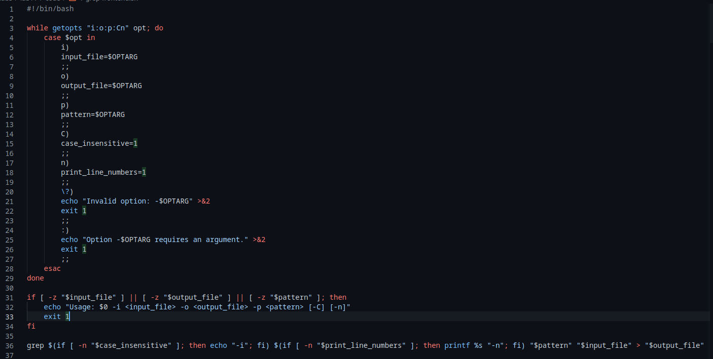
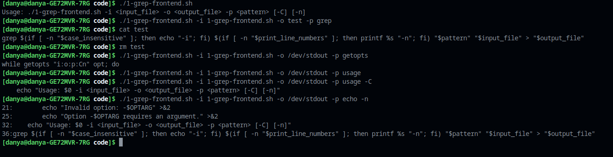
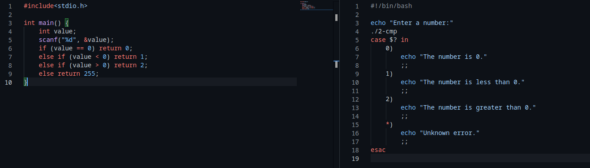
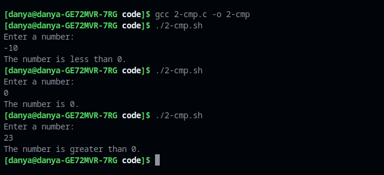
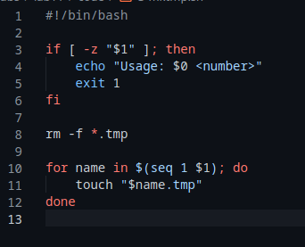
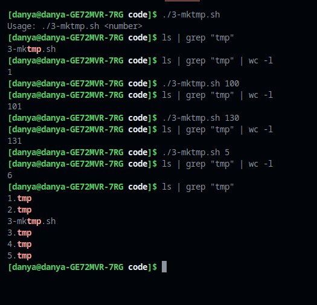
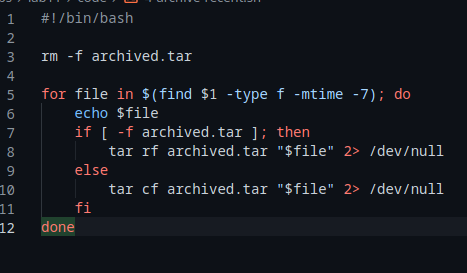

---
## Front matter
title: "Лабораторная работа 11"
subtitle: "Программирование в командном процессоре ОС UNIX. Ветвления и циклы"
author: "Генералов Даниил, НПИ-01-21, 1032212280"

## Generic otions
lang: ru-RU
toc-title: "Содержание"

## Bibliography
bibliography: bib/cite.bib
csl: pandoc/csl/gost-r-7-0-5-2008-numeric.csl

## Pdf output format
toc: true # Table of contents
toc-depth: 2
lof: true # List of figures
lot: true # List of tables
fontsize: 12pt
linestretch: 1.5
papersize: a4
documentclass: scrreprt
## I18n polyglossia
polyglossia-lang:
  name: russian
  options:
	- spelling=modern
	- babelshorthands=true
polyglossia-otherlangs:
  name: english
## I18n babel
babel-lang: russian
babel-otherlangs: english
## Fonts
mainfont: PT Serif
romanfont: PT Serif
sansfont: PT Sans
monofont: PT Mono
mainfontoptions: Ligatures=TeX
romanfontoptions: Ligatures=TeX
sansfontoptions: Ligatures=TeX,Scale=MatchLowercase
monofontoptions: Scale=MatchLowercase,Scale=0.9
## Biblatex
biblatex: true
biblio-style: "gost-numeric"
biblatexoptions:
  - parentracker=true
  - backend=biber
  - hyperref=auto
  - language=auto
  - autolang=other*
  - citestyle=gost-numeric
## Pandoc-crossref LaTeX customization
figureTitle: "Рис."
tableTitle: "Таблица"
listingTitle: "Листинг"
lofTitle: "Список иллюстраций"
lotTitle: "Список таблиц"
lolTitle: "Листинги"
## Misc options
indent: true
header-includes:
  - \usepackage{indentfirst}
  - \usepackage{float} # keep figures where there are in the text
  - \floatplacement{figure}{H} # keep figures where there are in the text
---

# Цель работы

Целью данной работы является: 

> Изучить основы программирования в оболочке ОС UNIX. Научится писать более сложные командные файлы с использованием логических управляющих конструкций и циклов.
# Задание

Требуется написать 4 командных файла:

- принимает аргументы с командной строки и использует их для запуска `grep`

- запускает другую программу и получает ее код выхода

- создает файлы с названиями, имеющими номер в последовательности

- создает архив из файлов, которые обновлены меньше чем неделю назад

# Теоретическое введение

Командный процессор (*shell*) -- это программа на Unix-системах, которая принимает ввод от пользователя и исполняет инструкции.
Помимо интерактивного использования, она может исполнять список команд, заданный в файле, и она обладает набором команд, достаточным для написания
программ разной степени сложности.
В этой работе мы продолжаем рассматриваьб этот функционал командного процессора, составляя несколько командных файлов, выполняющих определенные действия.

# Выполнение лабораторной работы

Первая программа представлена на рис. [-@fig:001].
Она принимает несколько аргументов с помощью `getopts` и запоминает их значения.
После этого, если все значения правильные, они подставляются в команду `grep`, которая читает один файл, ищет там строки по заданному шаблону и выводит их в файл.
Это показано на рис. [-@fig:002].

{ #fig:001 width=70% }

{ #fig:002 width=70% }

Вторая программа представлена на рис. [-@fig:003].
Она состоит из двух частей -- кода на языке Си и командного файла.
Код на Си принимает на ввод одно число и затем завершается с кодом возврата, соответствующим отношению этого числа к нулю.
Командный файл пишет приглашение, запускает эту программу, затем считывает код возврата и использует его внутри `case`.
В итоге получается вывод, как на рис. [-@fig:004].

{ #fig:003 width=70% }

{ #fig:004 width=70% }

Третья программа представлена на рис. [-@fig:005].
Сначала она удаляет все файлы с названием `*.tmp`.
После этого она создает несколько таких файлов, где каждый файл имеет имя `<номер файла>.tmp`.
Проверка того, как это работает, представлена на рис. [-@fig:006].

{ #fig:005 width=70% }

{ #fig:006 width=70% }

Четвертая программа представлена на рис. [-@fig:007].
Сначала она удаляет файл `archived.tar`, чтобы начать работу с новым файлом.
После этого она ищет файлы в указанном каталоге, у которых дата изменения меньше семи дней назад.
Каждый такой файл добавляется в архив `archived.tar`, или, если этот архив еще не создан, то он создается.
Проверка того, как это работает, представлена на рис. [-@fig:008].

{ #fig:007 width=70% }

{ #fig:008 width=70% }

# Контрольные вопросы

1. Каково предназначение команды getopts?

Эта команда изменяет состояние переменных окружения, чтобы обрабатывать аргументы с командной строки.
Каждый запуск этой программы поглощает один аргумент из списка и добавляет его значение в выбранную переменную окружения.
Оттуда различная пользовательская логика может извлекать эти значения и обрабатывать их дальше.

2. Какое отношение метасимволы имеют к генерации имён файлов?

Метасимволы, если не изолированы через литеральные строки или обратные слешы, обрабатываются оболочкой как список строк, равных именам файлов, которым соответствует последовательность с метасимволами.
Например, если задана команда `ls test/*`, и в каталоге `test` есть файлы `foo.txt`, `bar.txt`, `baz.txt` и директория `quux`, то оболочка раскроет эту строку как `ls test/foo.txt test/bar.txt test/baz.txt test/quux`.

3. Какие операторы управления действиями вы знаете?

В Bash используются следующие конструкции для управления потоком выполнения команд:

    - `if/then/else/fi`
    - `case/switch/default/esac`
    - `while/do/done`
    - `until/do/done`
    - `for/in/done`

4. Какие операторы используются для прерывания цикла?

Следующие операторы могут прервать текущий цикл:

    - `break` продолжит выполнение после конца блока цикла
    - `continue` продолжит выполнение со следующей итерации цикла
    - `return` прервет выполнение всей функции или программы

5. Для чего нужны команды false и true?

Эти команды всегда возвращают одно и тоже выходное значение и больше ничего не делают, что делает их удобными для подстановки конкретных значений в операторы. Например, бесконечный цикл начинается с `while true`.
Помимо этого эти программы можно использовать в ситуациях, где нужно предоставить путь к программе, но эта программа должна не делать ничего. Например, чтобы выключить доступ к оболочке для какого-то пользователя, можно указать его оболочку как `/bin/false`.

6. Что означает строка if test -f man$s/$i.$s, встреченная в командном файле?

Эта строка начинает блок кода, который будет выполнен только если существует файл с названием `man$s/$i.$s`, где `$s` и `$i` -- переменные.

7. Объясните различия между конструкциями while и until.

Эти два оператора создают циклы, но цикл `while` выполняется, пока выражение истинно, а `until` выполняется, пока выражение ложно. Таким образом, `while <условие>` -- это аналог `until !<условие>`.

# Выводы

В этой лабораторной работе мы познакомились с основами программирования в Bash.
Поскольку командный интерпретатор есть всегда, полезно уметь использовать его возможности не только в интерактивном режиме, но и для написания программ.
Те четыре программы, которые мы написали, каждая демонстрируют один из важных компонентов работы с командным интерпретатором.