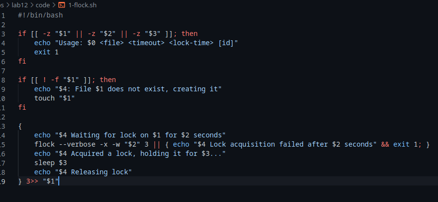
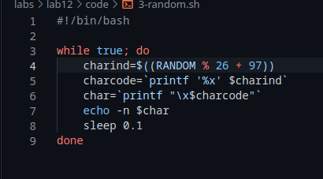

---
## Front matter
lang: ru-RU
title: Лабораторная работа 12
author: |
  Генералов Даниил, НПИ-01-21, 10322122800
institute: |
	\inst{1}RUDN University, Moscow, Russian Federation
date: 28 May, 2022

## Formatting
toc: false
slide_level: 2
theme: metropolis
header-includes: 
 - \metroset{progressbar=frametitle,sectionpage=progressbar,numbering=fraction}
 - '\makeatletter'
 - '\beamer@ignorenonframefalse'
 - '\makeatother'
aspectratio: 43
section-titles: true
---

# Цель и задачи

Изучить основы программирования в оболочке ОС UNIX. Научиться писать более
сложные командные файлы с использованием логических управляющих конструкций
и циклов.

## Задачи

Требуется написать 3 командных файла:

- берет эксклюзивное управление файлом и держит его некоторое время
- реализует отображение `man`-страниц
- выводит последовательность случайных символов

# Выполнение работы

## Программа для блокирования файлов

{ #fig:001 width=70% }

## Программа для отображения `man`-страниц

{ #fig:002 width=70%}

## Программа для вывода случайных символов

{ #fig:003 width=70%}

# Заключение

Командные файлы -- это удобный способ писать программы в той же самой среде, в которой работает пользователь.

Мы закончили знакомство со средствами разработки командных файлов, рассмотрев более сложные примеры.