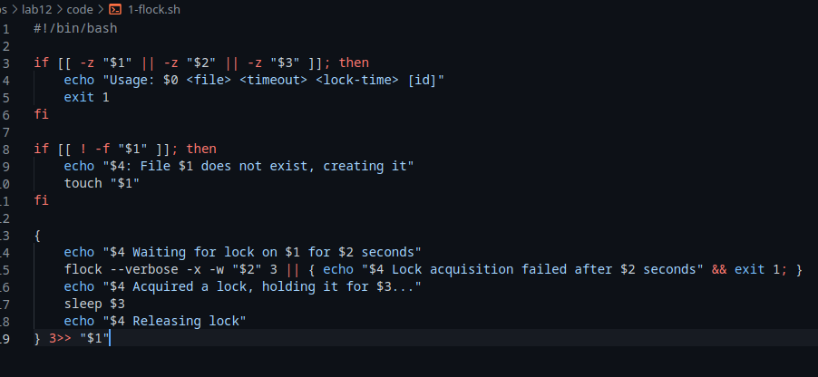
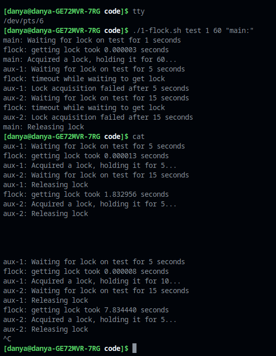
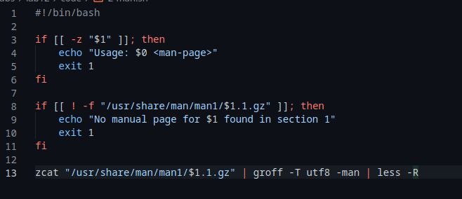
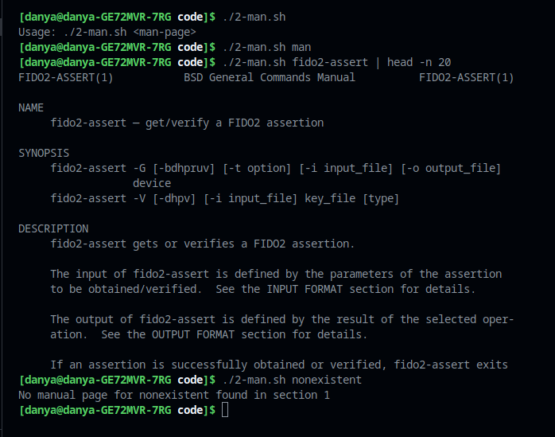
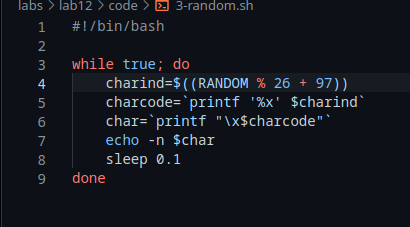
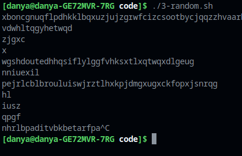

---
## Front matter
title: "Лабораторная работа 12"
subtitle: "Программирование в командном процессоре ОС UNIX. Расширенное программирование"
author: "Генералов Даниил, НПИ-01-21, 1032212280"

## Generic otions
lang: ru-RU
toc-title: "Содержание"

## Bibliography
bibliography: bib/cite.bib
csl: pandoc/csl/gost-r-7-0-5-2008-numeric.csl

## Pdf output format
toc: true # Table of contents
toc-depth: 2
lof: true # List of figures
lot: true # List of tables
fontsize: 12pt
linestretch: 1.5
papersize: a4
documentclass: scrreprt
## I18n polyglossia
polyglossia-lang:
  name: russian
  options:
	- spelling=modern
	- babelshorthands=true
polyglossia-otherlangs:
  name: english
## I18n babel
babel-lang: russian
babel-otherlangs: english
## Fonts
mainfont: PT Serif
romanfont: PT Serif
sansfont: PT Sans
monofont: PT Mono
mainfontoptions: Ligatures=TeX
romanfontoptions: Ligatures=TeX
sansfontoptions: Ligatures=TeX,Scale=MatchLowercase
monofontoptions: Scale=MatchLowercase,Scale=0.9
## Biblatex
biblatex: true
biblio-style: "gost-numeric"
biblatexoptions:
  - parentracker=true
  - backend=biber
  - hyperref=auto
  - language=auto
  - autolang=other*
  - citestyle=gost-numeric
## Pandoc-crossref LaTeX customization
figureTitle: "Рис."
tableTitle: "Таблица"
listingTitle: "Листинг"
lofTitle: "Список иллюстраций"
lotTitle: "Список таблиц"
lolTitle: "Листинги"
## Misc options
indent: true
header-includes:
  - \usepackage{indentfirst}
  - \usepackage{float} # keep figures where there are in the text
  - \floatplacement{figure}{H} # keep figures where there are in the text
---

# Цель работы

Целью данной работы является: 

> Изучить основы программирования в оболочке ОС UNIX. Научиться писать более сложные командные файлы с использованием логических управляющих конструкций и циклов.

# Задание

Требуется написать 3 командных файла:

- берет эксклюзивное управление файлом и держит его некоторое время

- реализует отображение `man`-страниц

- выводит последовательность случайных символов

# Теоретическое введение

Командный процессор (*shell*) -- это программа на Unix-системах, которая принимает ввод от пользователя и исполняет инструкции.
Помимо интерактивного использования, она может исполнять список команд, заданный в файле, и она обладает набором команд, достаточным для написания
программ разной степени сложности.
В этой работе мы продолжаем рассматриваьб этот функционал командного процессора, составляя несколько командных файлов, выполняющих определенные действия.

# Выполнение лабораторной работы

Первая программа представлена на рис. [-@fig:001].
Она принимает четыре аргумента: имя файла, время ожидания для получения блокировки и время, которое следует держать блокировку.
После получения соответствующих аргументов, программа пытается получить блокировку на файл с помощью команды `flock`.
Если это удается сделать за указанное время, программа ждет заданное время и затем освобождает блокировку.
Если нет, то программа выводит сообщение об ошибке и завершается.
Оба случая показаны на рис. [-@fig:002].

{ #fig:001 width=70% }

{ #fig:002 width=70% }


Вторая программа представлена на рис. [-@fig:003].
Она принимает один аргумент: имя `man`-страницы.
Если такая `man`-страница существует в стандартном расположении в разделе 1,
то эта страница читается с помощью `zcat`, разархивируя ее,
а затем обрабатывается через `groff` -- современную реализацию `roff`-инфраструктуры -- 
и показывается через `less`.
Чтобы показать это на рис. [-@fig:004], необходимо передать вывод `less` через какую-то программу,
которая не требует эксклюзивного доступа к терминалу -- я использую `head`.

{ #fig:003 width=70% }

{ #fig:004 width=70% }


Третья программа представлена на рис. [-@fig:005].
Она не принимает аргументов и выполняется бесконечно.
Она получает значение переменной `$RANDOM`, которое равномерно распределено между значениями 0 и 32767,
затем вычисляет остаток от деления этого числа на 26, а затем выводит символ ASCII, соответствующий маленькой букве с таким номером.
Пример вывода программы на рис. [-@fig:006] разделен символами новой строки, чтобы он был виден на одном экране.

{ #fig:005 width=70% }

{ #fig:006 width=70% }

# Контрольные вопросы


1. Найдите синтаксическую ошибку в следующей строке:

```bash
while [$1 != "exit"]
```

Здесь предполагается использовать проверку условия, но условие должно быть написано внутри двойных квадратных скобок (`[[ $1 != "exit" ]]`).

2. Как объединить (конкатенация) несколько строк в одну?

Для этого есть несколько способов:

```bash
A = "Hello, "
B = "World!"
C1 = "$A$B"
C2 = $(echo -n $A $B)
C3 = `printf "%s%s" "$A" "$B"`
```


3. Найдите информацию об утилите seq. Какими иными способами можно реализовать её функционал при программировании на bash?

Команда `seq` предоставляет возможность получить последовательность чисел от начального до конечного значения включительно:

```bash
$ seq 1 10 2
1
3
5
7
9
```

Если все эти параметры являются константами, можно использовать синтаксис списков:

```bash
$ echo {1..10..2}
1 3 5 7 9
```

4. Какой результат даст вычисление выражения $((10/3))?

Это выражение имеет значение `3`. Это потому, что оператор `/` в арифметике в Bash округляет ответ до целого числа.

5. Укажите кратко основные отличия командной оболочки zsh от bash.

Оболочка `zsh` имеет несколько отличающийся интерфейс от `bash`, и эти отличия могут делать ее более удобной для интерактивного использования.
Например, используя команду `z`, можно перейти к часто используемой директории по имени.
Помимо этого, `zsh` имеет большую поддержку для расширения функционала, например для создания плагинов для отображения текущего состояния `git`-репозитория.

С точки зрения API программирования, `zsh` поддерживает дробную арифметику, и использует несколько другой механизм от `bash` для определения опций автодополнения.

6. Проверьте, верен ли синтаксис данной конструкции
```bash
for ((a=1; a <= LIMIT; a++))
```

Да, такой синтаксис работает в `bash`.

7. Сравните язык bash с какими-либо языками программирования. Какие преимущества у bash по сравнению с ними? Какие недостатки?

Одной из отличительных особенностей `sh`-подобных языков является то, что они имеют только один тип данных -- строки. Когда в языках вроде C, Python, и даже JavaScript и PHP есть различные типы данных, имеющих разные правила работы, в `bash` все переменные -- в том числе числа и списки -- это строки. Является ли это преимуществом или недостатком -- спорный вопрос.

Среди преимуществ можно считать то, что этот язык доступен везде -- любая POSIX-совместимая система будет иметь возможность использовать его как основной язык программирования, даже когда другие компиляторы и интерпретаторы отсутствуют.

Среди недостатков можно считать то, что этот язык поддерживает только одну парадигму программирования -- императивно-процедурное. Когда языки вроде C/C++ в основном императивные, но имеют элементы объектно-ориентированного программирования, и Python по умолчанию объектно-ориентированный, но может иметь элементы функционального программирования, а Haskell по умолчанию функциональный, но может использоваться как императивный, в Bash же есть только одна парадигма, от которой нельзя отойти.


# Выводы

В этой лабораторной работе мы закончили знакомство с основами программирования в Bash.
Мы рассмотрели продвинутые концепции программирования, которые позволяют нам писать более сложные программы в Bash.
В дальнейщем этот навык может оказаться весьма полезным.