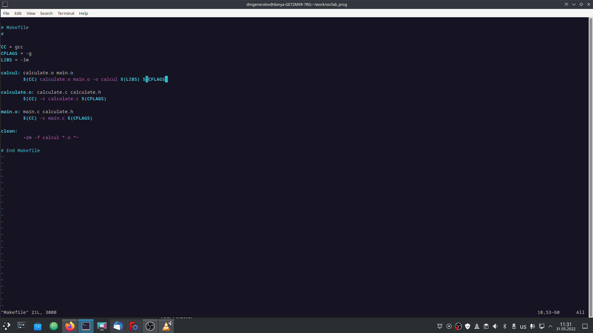
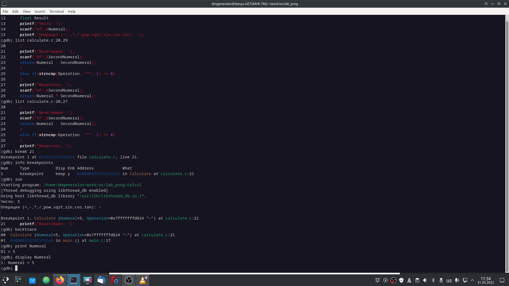
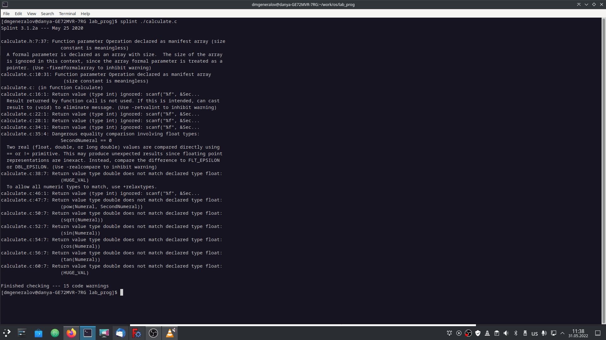

---
## Front matter
lang: ru-RU
title: Лабораторная работа 13
author: |
  Генералов Даниил, НПИ-01-21, 10322122800
institute: |
	\inst{1}RUDN University, Moscow, Russian Federation
date: 31 May, 2022

## Formatting
toc: false
slide_level: 2
theme: metropolis
header-includes: 
 - \metroset{progressbar=frametitle,sectionpage=progressbar,numbering=fraction}
 - '\makeatletter'
 - '\beamer@ignorenonframefalse'
 - '\makeatother'
aspectratio: 43
section-titles: true
---

# Цель и задачи

Приобрести простейшие навыки разработки, анализа, тестирования и отладки при-
ложений в ОС типа UNIX/Linux на примере создания на языке программирования
С калькулятора с простейшими функциями.

## Задачи

Требуется скомпилировать код на C, отладить его с помощью отладчика GDB,
затем проанализировать его с помощью `splint`.

# Выполнение работы

## Сборка

Написанный Makefile позволяет скомпилировать несколько файлов одной командой.

{ #fig:001 width=70% }

## Отладка

Если программа скомпилирована с отладочными символами, то она может быть запущена
через отладчик GDB. Там можно останавливать программу и просматривать переменные.

{ #fig:002 width=70% }

## Статический анализ

Утилита `splint` позволяет проверить код на возможные ошибки.

{ #fig:003 width=70% }

# Заключение

В Linux есть широкий набор инструментов для написания программ на C.
Мы познакомились с основными из них -- компилятор, отладчик, статический анализатор.