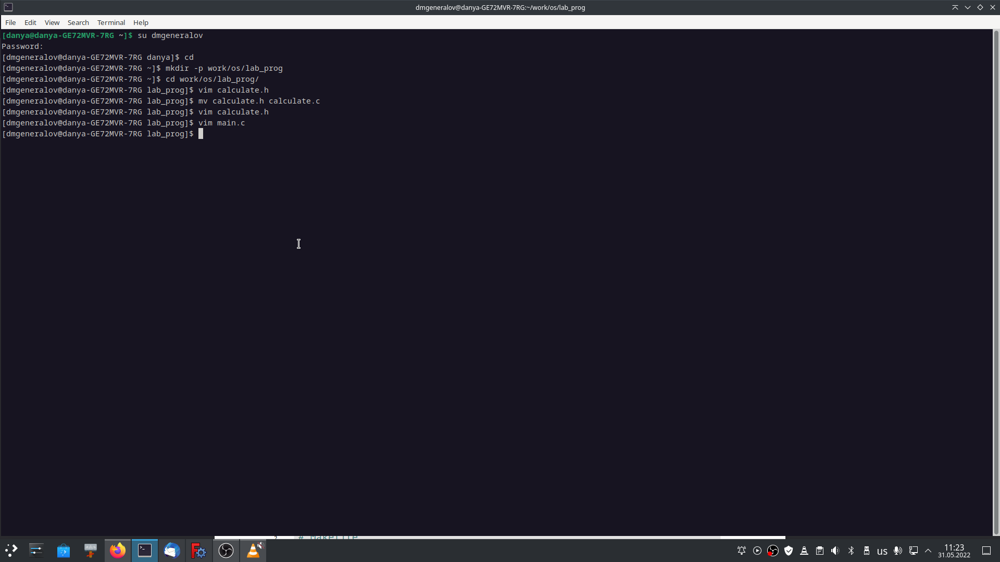
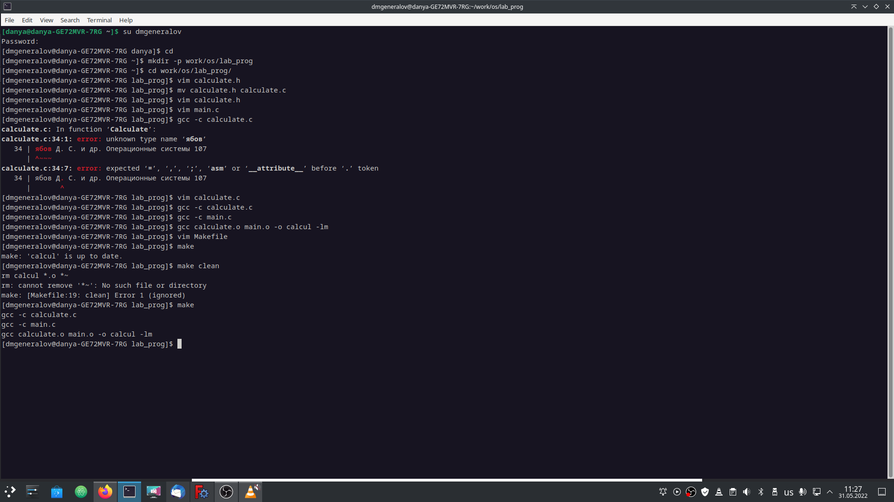
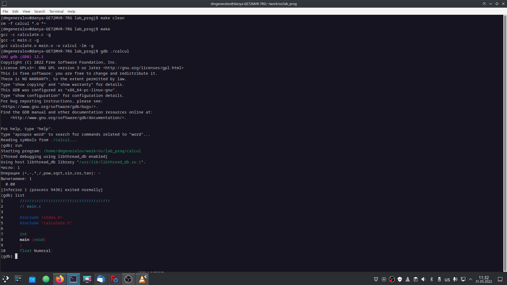
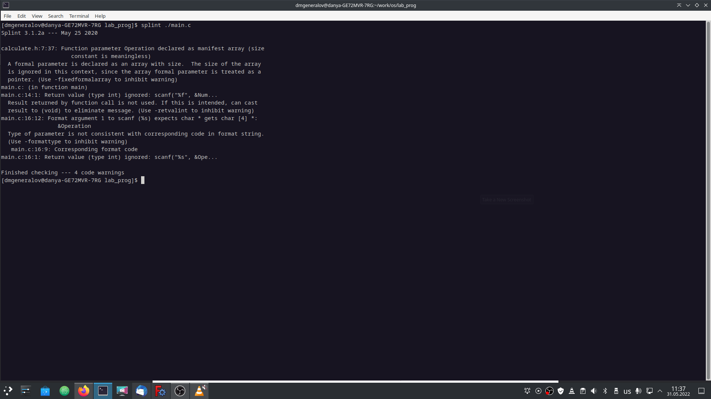

---
## Front matter
title: "Лабораторная работа 13"
subtitle: "Средства, применяемые при разработке программного обеспечения в ОС типа UNIX/Linux"
author: "Генералов Даниил, НПИ-01-21, 1032212280"

## Generic otions
lang: ru-RU
toc-title: "Содержание"

## Bibliography
bibliography: bib/cite.bib
csl: pandoc/csl/gost-r-7-0-5-2008-numeric.csl

## Pdf output format
toc: true # Table of contents
toc-depth: 2
lof: true # List of figures
lot: true # List of tables
fontsize: 12pt
linestretch: 1.5
papersize: a4
documentclass: scrreprt
## I18n polyglossia
polyglossia-lang:
  name: russian
  options:
	- spelling=modern
	- babelshorthands=true
polyglossia-otherlangs:
  name: english
## I18n babel
babel-lang: russian
babel-otherlangs: english
## Fonts
mainfont: PT Serif
romanfont: PT Serif
sansfont: PT Sans
monofont: PT Mono
mainfontoptions: Ligatures=TeX
romanfontoptions: Ligatures=TeX
sansfontoptions: Ligatures=TeX,Scale=MatchLowercase
monofontoptions: Scale=MatchLowercase,Scale=0.9
## Biblatex
biblatex: true
biblio-style: "gost-numeric"
biblatexoptions:
  - parentracker=true
  - backend=biber
  - hyperref=auto
  - language=auto
  - autolang=other*
  - citestyle=gost-numeric
## Pandoc-crossref LaTeX customization
figureTitle: "Рис."
tableTitle: "Таблица"
listingTitle: "Листинг"
lofTitle: "Список иллюстраций"
lotTitle: "Список таблиц"
lolTitle: "Листинги"
## Misc options
indent: true
header-includes:
  - \usepackage{indentfirst}
  - \usepackage{float} # keep figures where there are in the text
  - \floatplacement{figure}{H} # keep figures where there are in the text
---

# Цель работы

Целью данной работы является: 

> Приобрести простейшие навыки разработки, анализа, тестирования и отладки приложений в ОС типа UNIX/Linux на примере создания на языке программирования С калькулятора с простейшими функциями.

# Задание

Требуется взять код на C, скомпилировать его, затем отладить его с помощью GDB и проанализировать исходный код с помощью `splint`.

# Теоретическое введение


При разработке программ на Linux можно использовать широкий набор инструментов, которые помогают в этом.
В этой лабораторной работе мы рассматриваем некоторые из них -- помимо стандартных утилит вроде `make` и `gcc`, 
мы используем отладчик GDB и программу статического анализа исходного кода `splint`.

# Выполнение лабораторной работы

Сначала нам требуется ввести существующий код, как показано на рисунке [-@fig:001].

{ #fig:001 width=70% }


После этого, вручную скомпилировав и исправив ошибки, мы создаем и опробуем Makefile, чтобы компилировать программу автоматически.
Это показано на рисунке [-@fig:002].

{ #fig:002 width=70% }

После этого нужно сделать некоторые изменения в этом Makefile, и финальное состояние этого файла показано на рис. [-@fig:003].
В начале там задаются параметры вроде названия компилятора и флагов конфигурации к нему, вроде используемых библиотек и параметров добавления диагностической информации.
После этого идут указания *целей*: файлов, которые можно собрать, тех файлов, которые должны быть собраны для сборки этого файла, и команд для сборки их.
Например, чтобы собрать файл `calcul`, уже должны быть собраны файлы `calculate.o` и `main.o`, и нужно выполнить команду `gcc calculate.o main.o -o calcul -o calcul -lm -g`.
Наконец, указывается цель `clean`, которая удаляет все собранные файлы.

{ #fig:003 width=70% }

Теперь, когда программа собрана, можно запустить её в GDB. Это показано на рисунке [-@fig:004].
Команда `run` запускает программу для отладки, а команда `list` показывает исходный код программы вокруг места остановки.

{ #fig:004 width=70% }

Команда `list` принимает аргумент -- это может быть диапазон строк, которые следует вывести, или название файла и диапазон строк в нем.
После команды `list` можно набрать команду `break`, которая создаст точку останова на указанной строке в последнем отображенном файле.
Когда точка останова создана и программа запущена, она будет остановлена перед выполнением этой строки.
После этого можно использовать команды `backtrace`, чтобы посмотреть на стек вызовов.
Здесь же можно отобразить информацию о переменных с помощью команд `print` и `display`.

{ #fig:005 width=70% }

Также можно использовать программу `splint`, чтобы проверить код на возможные ошибки.
Результаты вызова этой программы на двух файлах показаны на рисунках [-@fig:006] и [-@fig:007].

{ #fig:006 width=70% }

{ #fig:007 width=70% }

Среди обнаруженных проблем можно отметить следующие: 

- Результат вызова `scanf` игнорируется, что может скрывать ошибки при чтении с клавиатуры.
- Функция `calculate.c:Calculate` принимает параметр `char[4]`, но на самом деле он используется как `char*`, из-за чего параметр длины не имеет значения.
- Осуществляется сравнение на равенство с помощью оператора `==` над значениями типа `float`, что может приводить к ошибкам из-за погрешности вычислений дробных чисел.
- Некоторые из используемых функций возвращают значение типа `double`, а не `float`, и используется скрытое преобразование между ними.

# Контрольные вопросы

1. Как получить информацию о возможностях программ gcc, make, gdb и др.?

Это можно сделать, как и для любой другой программы, с помощью `man` или через флаг `--help`.

2. Назовите и дайте краткую характеристику основным этапам разработки приложений
в UNIX.

- Написание кода в текстовом редакторе -- используется `vim` или `emacs`.
- Создание структуры компиляции программы -- используется `make` или `cmake`.
- Статическая проверка кода на ошибки -- используется `lint` или `splint`.
- Отладка программы -- используется `gdb` или `lldb`.
- Сохранение изменений -- используется `git` или `hg`.

3. Что такое суффикс в контексте языка программирования? Приведите примеры использования.

В C/C++ можно добавить к численному литералу дополнительные символы, чтобы обозначить тип данных этого литерала.
Например, по умолчанию запись `1.0` имеет тип `double`, а запись `1.0f` имеет тип `float`.
Аналогично, по умолчанию запись `123` имеет тип `int`, запись `123l` имеет тип `long int`, а запись `123u` имеет тип `unsigned int`.


4. Каково основное назначение компилятора языка С в UNIX?

Как следует из названия, он нужен для компиляции кода на языке С.
Это нужно для того, чтобы программы были портативными между системами с разными архитектурами и процессорами.

5. Для чего предназначена утилита make?

Она нужна для того, чтобы иметь одну команду для выполнения всех необходимых действий по сборке программы.
Используя собственный анализатор, `make` определяет, какие действия по сборке программы уже выполнены, а какие ещё предстоит выполнить, и делает только необходимые действия параллельно.

6. Приведите пример структуры Makefile. Дайте характеристику основным элементам этого файла.

```makefile
all: program  # указание основной цели

program: a.o b.o c.o  # указание зависимостей
    gcc -o program a.o b.o c.o  # указание команды компиляции

a.o:  # указание отдельных компонентов программы
    gcc -c a.c  # указание команды компиляции

b.o:
    gcc -c b.c

c.o:
    gcc -c c.c

clean: # указание команды для очистки всех собранных файлов
    rm -f *.o program
```


7. Назовите основное свойство, присущее всем программам отладки. Что необходимо сделать, чтобы его можно было использовать?

Все программы отладки позволяют просматривать исходный код программы, останавливать исполнение на определенных местах и рассматривать состояние
остановленной программы, если эта программа была скомпилирована с отладочной информацией (например, флагом `-g` в `GCC`).

8. Назовите и дайте основную характеристику основным командам отладчика gdb.

- `list` -- показывает исходный код программы
- `break` -- позволяет поставить точку останова на определенном месте программы
- `run` -- запускает программу
- `step` -- позволяет произвести один шаг в программе
- `next` -- позволяет произвести один шаг в программе, не заходя внутрь стека
- `finish` -- делает шаги до конца текущего фрейма стека
- `backtrace` -- показывает стек вызовов
- `display` -- позволяет просматривать значения переменных в программе

9. Опишите по шагам схему отладки программы, которую Вы использовали при выполнении лабораторной работы.

```gdb
(gdb) run
(gdb) list
(gdb) list 12,15
(gdb) list calculate.c:20,29
(gdb) list calculate.c:20,27
(gdb) break 21
(gdb) info breakpoints
(gdb) run
5
-
(gdb) backtrace
(gdb) print Numeral
(gdb) display Numeral
(gdb) info breakpoints
(gdb) delete 1
(gdb) quit
```

10. Прокомментируйте реакцию компилятора на синтаксические ошибки в программе при его первом запуске.

Он вывел сообщения, указывающие на строки с ошибками и сообщающие, что именно неожиданно об этом синтаксисе в этом месте кода.

11. Назовите основные средства, повышающие понимание исходного кода программы.

Среди таких средств можно считать функции редактора текста -- подсветку синтаксиса, автоматическую табуляцию и свертку блоков кода -- 
сообщения компилятора, если такие присутствуют, а также утилиты вроде `lint`/`splint`, которые анализируют код на частые ошибки.

12. Каковы основные задачи, решаемые программой splint?

Она обращает внимание программиста на возможные ошибки в коде, которые могут привести к неправильной работе программы в неожиданных ситуациях.

# Выводы

В этой лабораторной работе мы рассмотрели (во второй раз) средства разработки программ в Linux.
Хотя для большинства этих средств есть графические интерфейсы,
знать про их использование с командной строки может быть полезным.