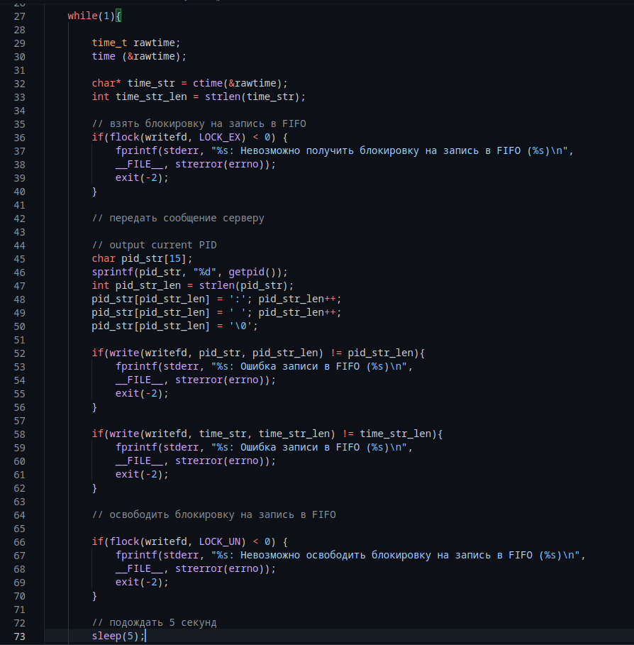
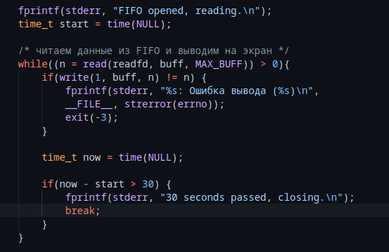
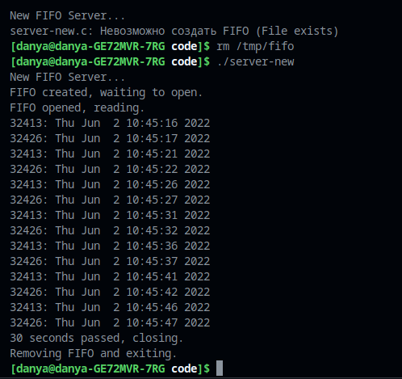

---
## Front matter
lang: ru-RU
title: Лабораторная работа 14
author: |
  Генералов Даниил, НПИ-01-21, 10322122800
institute: |
	\inst{1}RUDN University, Moscow, Russian Federation
date: 2 June, 2022

## Formatting
toc: false
slide_level: 2
theme: metropolis
header-includes: 
 - \metroset{progressbar=frametitle,sectionpage=progressbar,numbering=fraction}
 - '\makeatletter'
 - '\beamer@ignorenonframefalse'
 - '\makeatother'
aspectratio: 43
section-titles: true
---

# Цель и задачи

Приобретение практических навыков работы с именованными каналами.

## Задачи

Требуется изменить программу, работающую с именоваными каналами, чтобы она имела дополнительный функционал:

- несколько записывающих процессов
- записывающие процессы пишут раз в 5 секунд
- читающий процесс завершается через 30 секунд

# Выполнение работы

## Клиент

{ #fig:001 width=100% }

## Сервер

{ #fig:002 width=100% }

## Результат

{ #fig:003 width=100% }

# Заключение

Мы получили опыт работы с именованными каналами, и понимаем, каким они похожи на файлы, или что более важно, каким образом они не похожи.