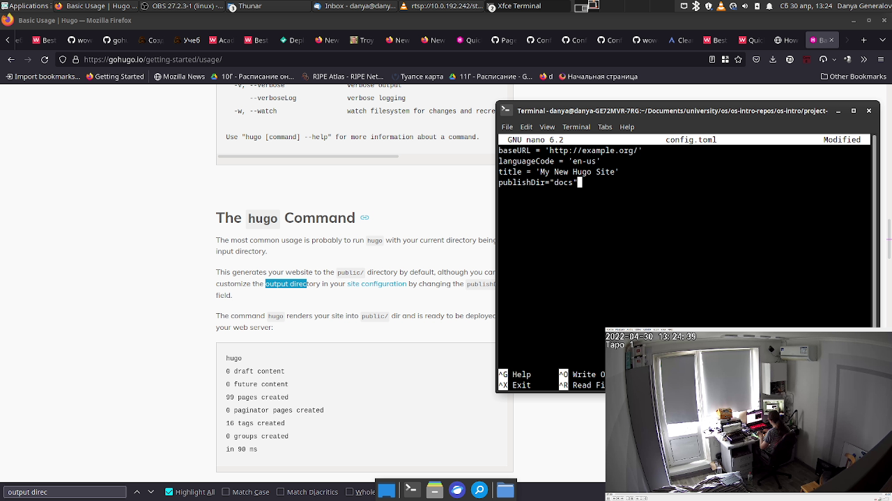

---
## Front matter
title: "Отчет по персональному проекту версии 1"
subtitle: ""
author: "Генералов Даниил, НПИ-01-21, 1032212280"

## Generic otions
lang: ru-RU
toc-title: "Содержание"

## Bibliography
bibliography: bib/cite.bib
csl: pandoc/csl/gost-r-7-0-5-2008-numeric.csl

## Pdf output format
toc: true # Table of contents
toc-depth: 2
lof: true # List of figures
lot: true # List of tables
fontsize: 12pt
linestretch: 1.5
papersize: a4
documentclass: scrreprt
## I18n polyglossia
polyglossia-lang:
  name: russian
  options:
	- spelling=modern
	- babelshorthands=true
polyglossia-otherlangs:
  name: english
## I18n babel
babel-lang: russian
babel-otherlangs: english
## Fonts
mainfont: PT Serif
romanfont: PT Serif
sansfont: PT Sans
monofont: PT Mono
mainfontoptions: Ligatures=TeX
romanfontoptions: Ligatures=TeX
sansfontoptions: Ligatures=TeX,Scale=MatchLowercase
monofontoptions: Scale=MatchLowercase,Scale=0.9
## Biblatex
biblatex: true
biblio-style: "gost-numeric"
biblatexoptions:
  - parentracker=true
  - backend=biber
  - hyperref=auto
  - language=auto
  - autolang=other*
  - citestyle=gost-numeric
## Pandoc-crossref LaTeX customization
figureTitle: "Рис."
tableTitle: "Таблица"
listingTitle: "Листинг"
lofTitle: "Список иллюстраций"
lotTitle: "Список таблиц"
lolTitle: "Листинги"
## Misc options
indent: true
header-includes:
  - \usepackage{indentfirst}
  - \usepackage{float} # keep figures where there are in the text
  - \floatplacement{figure}{H} # keep figures where there are in the text
---

# Цель работы

Целью данной работы является установка генератора статических сайтов Hugo и развертка шаблона сайта на GitHub Pages.

# Задание

Для выполнения работы требуется установить программу Hugo, создать репозиторий для сайта на GitHub Pages, затем провести развертку шаблона сайта на GitHub Pages.

# Теоретическое введение

Один из удобных способов создания статических сайтов (то есть тех, которые в основном состоят из неизменного контента) -- это применить генератор статических сайтов. Это программа, которая принимает на вход документы, написанные на промежуточном языке разметки (например Markdown), и выдают набор HTML-страниц, которые затем можно разместить на хостинг.

Один из таких хостингов -- GitHub Pages. С помощью инфраструктуры CI можно сделать так, чтобы содержимое вашего репозитория публиковалось в интернете на определенном доменном имени -- без использования своей инфраструктуры и не требуя никакой настройки серверов.

# Выполнение лабораторной работы

Первым делом нужно создать новый репозиторий, внутри которого будут храниться данные сайта. Это можно сделать из командной строки или с помощью веб-интерфейса на рис. [-@fig:001].

{ #fig:001 width=70% }

Дальше я добавил этот репозиторий в основной репозиторий как подмодуль и использовал команду `hugo new site`, чтобы создать шаблон сайта, как показано на рис. [-@fig:002].

{ #fig:002 width=70% }

После этого я начал искать, как установить тему Academic, и посредством этого поиска узнал, что она теперь называется Wowchemy, и метод установки изменился. Я узнал это на форуме Wowchemy на GitHub, который показан на рис. [-@fig:003].

{ #fig:003 width=70% }

Как оказалось, нужно включить его как зависимость в определенном файле в корне репозитория, и после этого шаблон темы был успешно собран, как показано на рис. [-@fig:004].

{ #fig:004 width=70% }

После этого была задача опубликовать это на GitHub Pages. Есть две опции, где хранятся файлы, подлежащие публикации -- в корне репозитория или в папке `docs`. По умолчанию Hugo собирает сайт в папку `public`, поэтому нужно добавить ключ конфигурации, меняющий это поведение -- он вносится в файл `config.toml` в корне репозитория, как показано на рис. [-@fig:005].

{ #fig:005 width=70% }

После этого можно сделать коммит с новым сайтом (рис. [-@fig:006]) и посмотреть на него на GitHub Pages (рис. [-@fig:007]). Но сразу заметно, что что-то не так.

{ #fig:006 width=70% }

{ #fig:007 width=70% }

Как нетрудно увидеть, на странице полностью нет форматирования. Если посмотреть в консоли запросов на рис. [-@fig:008], то можно увидеть проблему -- все ресурсы сайта выходят с ошибкой 404, хотя в папке сборки присутствуют. Дело в том, что пути к ресурсам начинаются с корня сайта, а GitHub Pages публикует проект в субдиректории, что ломает адресацию. 

{ #fig:008 width=70% }

Причина того, что GitHub Pages делает так, заключается в том, что страницы проектов являются подстраницами пользователей или организаций. Я не хотел использовать свою страницу пользователя только для этого проекта, поэтому я вместо этого подумал создать организацию. К сожалению, страница "создать организацию" делает впечатление, будто для того, чтобы это сделать, необходимо заплатить -- когда я делал работу, я полностью пропустил бесплатную опцию на странице на рис. [-@fig:009].

{ #fig:009 width=70% }

Вместо этого я решил пойти другим путём. У меня есть доменное имя, `danya02.ru`, и я могу направить один из поддоменов на GitHub Pages. Первый шаг для этого -- это прописать DNS-записи в моей записи, чтобы этот поддомен оказался перенаправленным на GitHub Pages. Я добавил для начала `A`-записи, как показано на рис. [-@fig:010].

{ #fig:010 width=70% }

К сожалению, сделав это, я сделал невозможным для GitHub получить TLS-сертификат на этот домен, и поэтому при открытии этого поддомена появлялось окно, говорящее о неправильном сертификате (рис. [-@fig:011]).

{ #fig:011 width=70% }

Чтобы справиться с этим, как оказалось, нужно указывать не простые `A`-записи, а `CNAME`-записи, фактически осуществляющие перенаправление с одного домена на другой. Я добавил `CNAME`-запись, указывающую на свой поддомен на GitHub Pages, как показано на рис. [-@fig:012].

{ #fig:012 width=70% }

После этого интерфейс GitHub Pages подтвердил, что процесс создания сертификата начат (рис. [-@fig:013]), и после нескольких минут сайт стал открываться без предупреждений (рис. [-@fig:014]).

{ #fig:013 width=70% }

{ #fig:014 width=70% }

Текущее состояние сайта можно увидеть по адресу https://dmgeneralov-rudn-os-intro.danya02.ru/.

# Выводы

В этой работе мы успешно установили Hugo, сделали шаблон сайта, и опубликовали его на GitHub Pages.
Используя эти инструменты, можно быстро создавать сайты без написания кода HTML или развертки собственных серверов.
Поэтому такие сайты идеально подходят для проектов, которые не подразумевают высокой сложности пользовательского взаимодействия и в основном служат для публикации контента.
В следующих шагах этого проекта мы сможем добавить контента к этому сайту.