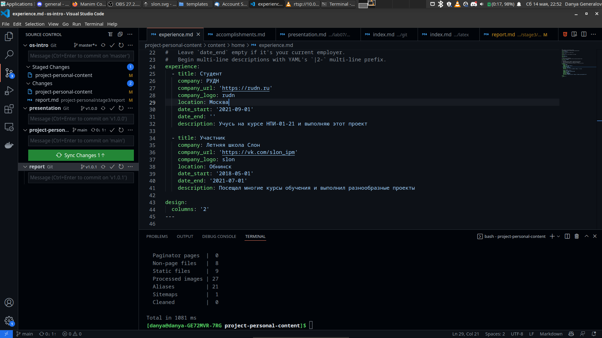
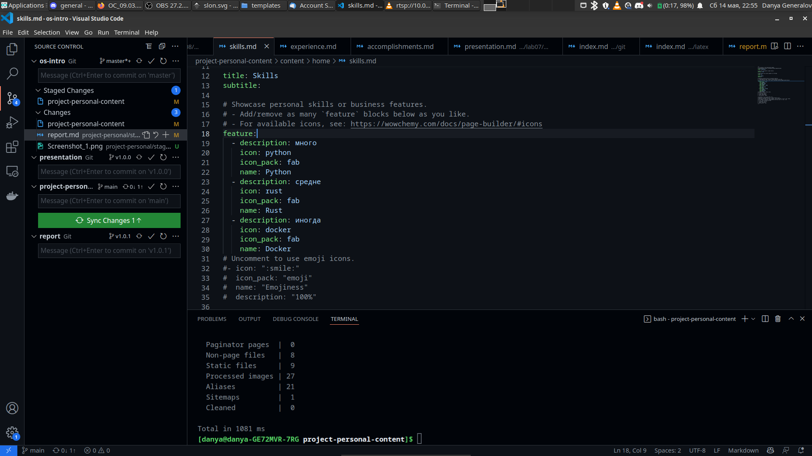
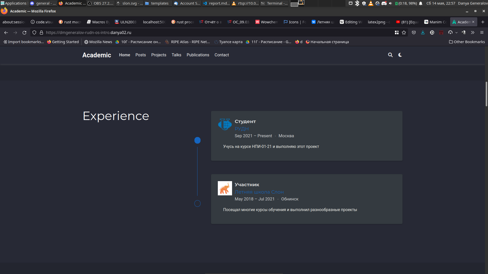
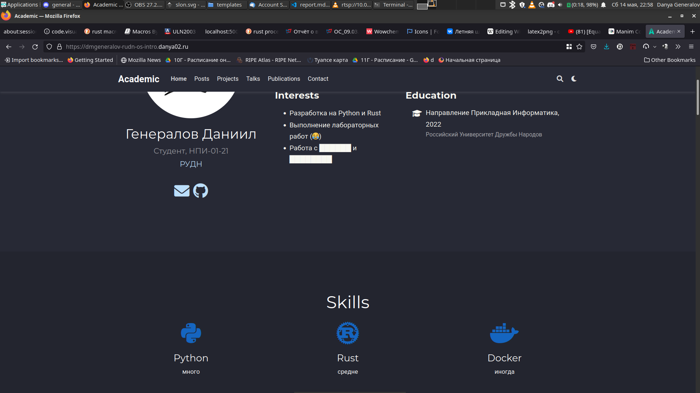

---
## Front matter
title: "Индивидуальный проект 3"
subtitle: "Добавление достижений и навыков"
author: "Генералов Даниил, НПИ-01-21, 1032212280"

## Generic otions
lang: ru-RU
toc-title: "Содержание"

## Bibliography
bibliography: bib/cite.bib
csl: pandoc/csl/gost-r-7-0-5-2008-numeric.csl

## Pdf output format
toc: true # Table of contents
toc-depth: 2
lof: true # List of figures
lot: true # List of tables
fontsize: 12pt
linestretch: 1.5
papersize: a4
documentclass: scrreprt
## I18n polyglossia
polyglossia-lang:
  name: russian
  options:
	- spelling=modern
	- babelshorthands=true
polyglossia-otherlangs:
  name: english
## I18n babel
babel-lang: russian
babel-otherlangs: english
## Fonts
mainfont: PT Serif
romanfont: PT Serif
sansfont: PT Sans
monofont: PT Mono
mainfontoptions: Ligatures=TeX
romanfontoptions: Ligatures=TeX
sansfontoptions: Ligatures=TeX,Scale=MatchLowercase
monofontoptions: Scale=MatchLowercase,Scale=0.9
## Biblatex
biblatex: true
biblio-style: "gost-numeric"
biblatexoptions:
  - parentracker=true
  - backend=biber
  - hyperref=auto
  - language=auto
  - autolang=other*
  - citestyle=gost-numeric
## Pandoc-crossref LaTeX customization
figureTitle: "Рис."
tableTitle: "Таблица"
listingTitle: "Листинг"
lofTitle: "Список иллюстраций"
lotTitle: "Список таблиц"
lolTitle: "Листинги"
## Misc options
indent: true
header-includes:
  - \usepackage{indentfirst}
  - \usepackage{float} # keep figures where there are in the text
  - \floatplacement{figure}{H} # keep figures where there are in the text
---

# Цель работы

Цель данной работы -- реализовать третью стадию индивидуального проекта и выполнить его задания.

# Задание

- Добавить информацию о себе на сайте
- Создать два поста на сайте

# Теоретическое введение

Используемый образец в Hugo использует несколько файлов Markdown для получения содержимого модулей на странице. Как и в предыдущей работе, мы редактируем эти файлы, чтобы настроить содержимое модулей.

# Выполнение лабораторной работы

Для того, чтобы написать про свой опыт, достижения и навыки, нужно отредактировать файлы в `content/home`, названия которых самодокументирующиеся -- про опыт следует написать в `experience.md` (рис. [-@fig:001]), а про навыки -- в `skills.md` (рис. [-@fig:002]).

{ #fig:001 width=70% }

{ #fig:002 width=70% }

После написания этой части документа, а также постов, можно отправить изменения на сервер и посмотреть, как они выглядят на сайте -- это можно посмотреть на активном сайте на https://dmgeneralov-rudn-os-intro.danya02.ru/ или на рис. [-@fig:003] и [-@fig:004].

{ #fig:003 width=70% }

{ #fig:004 width=70% }

# Выводы

Добавление информации на сайт, составленный из таких модулей, довольно просто и удобно, и по мере заполнения сайта он будет становиться все более и более полезным.