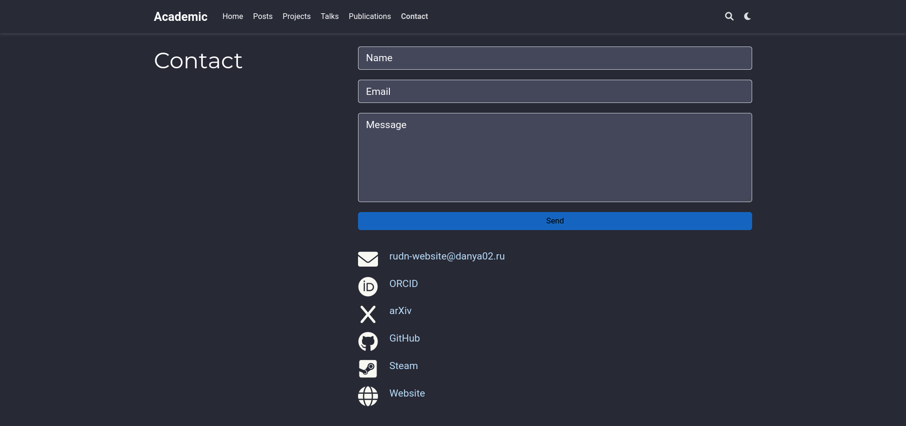

---
## Front matter
lang: ru-RU
title: Индивидуальный проект 4
author: |
  Генералов Даниил, НПИ-01-21, 1032212280
institute: |
	\inst{1}RUDN University, Moscow, Russian Federation
date: 21 May, 2022

## Formatting
toc: false
slide_level: 2
theme: metropolis
header-includes: 
 - \metroset{progressbar=frametitle,sectionpage=progressbar,numbering=fraction}
 - '\makeatletter'
 - '\beamer@ignorenonframefalse'
 - '\makeatother'
aspectratio: 43
section-titles: true
---

# Цель и задачи

Добавить ссылки на себя на сайт.

## Задачи

  - Добавить ссылки на себя на сайт.
  - Добавить две статьи.

# Ход работы

## Добавление информации
  - Информация по модулям главной страницы хранится в папке `content/home`
  - Чтобы добавить ссылки на себя, нужно отредактировать `content/home/contact.md`
  - После этого главная страница содержит часть на рис. [-@fig:001]

{ #fig:001 width=70% }

## Добавление постов

- Посты добавляются в свою директорию в папке `content/posts`
- Они автоматически добавляются в список постов

# Заключение

- Мы добавили контент на сайт
- Дальше мы будем добавлять больше контента на сайт
- Добавление контента -- это основное действие, которое мы будем делать с сайтом